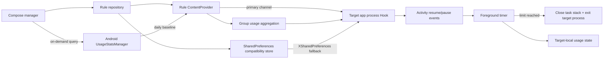

# Time Stop (Android / LSPosed)

Precision app-time control for Android power users who want policy, telemetry, and enforcement in the same loop.

Current version: `0.9.2`

## Why Not Just Use Stock Screen Time?

Different Android vendors ship different screen-time features, but the usual model is still broad and UI-driven. Time Stop leans into LSPosed: the rule engine runs inside the target app process, counts foreground time from lifecycle events, and can close the task when a boundary is hit.

| Dimension | Stock screen time | Time Stop |
| --- | --- | --- |
| Core model | Usage reports, daily limits, focus modes | Composable enforcement rules for selected apps |
| Time granularity | Mostly daily totals | Daily quota + per-launch timer + post-exit cooldown |
| Schedule logic | Commonly fixed focus windows | Allow-only or block-during weekly windows, multi-day and overnight aware |
| Shared budgets | Rare or vendor-specific | App groups with one shared daily allowance |
| Enforcement path | System blocker or reminder | Countdown, task close, and target-process exit for third-party apps |
| Observability | Usually hidden | Hook heartbeat, rule source, limit hits, and diagnostic logs |
| Runtime | System feature | Root + LSPosed, executing in target app processes |

Time Stop is not a soft "please stop scrolling" timer. It is a small policy engine for app usage: rules, foreground accounting, warning UI, exit execution, statistics, update checks, and field diagnostics all live in one workflow.

## Feature Highlights

| Capability | What it does |
| --- | --- |
| Independent app rules | Each app keeps its own enabled state, daily quota, per-launch quota, schedule windows, warning style, and cooldown behavior. |
| App groups and shared allowance | Put multiple apps into one group with a shared 1-1,440 minute daily budget. App-level daily, per-launch, and schedule rules still run in parallel; the first threshold wins. |
| Daily cumulative mode | Uses the stronger source for each app: Android system usage when available, or Hook-local foreground accounting, then resets at local midnight. |
| Per-launch mode | Starts a fresh timer when the target app's main process begins a foreground session. |
| Weekly schedules | Supports allow-only and block-during windows across multiple weekdays, including overnight ranges. Schedule blocks cannot be bypassed with the delay action. |
| Foreground-only accounting | Counts only the `onResume` to `onPause` phase. Background residency does not burn the quota. |
| Warning UI | Shows a five-second top banner or opt-in full-screen warning, with layout handling for portrait, landscape, display cutouts, and immersive apps. |
| Delay action | Lets the user add 1-60 minutes for normal time limits while keeping schedule blocks strict. |
| Post-exit cooldown | Blocks reopening for 1-1,440 minutes after a forced exit. Repeated attempts do not refresh the cooldown or inflate limit-hit counts. |
| Group sync loop | Grouped foreground apps synchronize usage every 15 seconds without keeping the manager app alive. |
| Hook verification | Persists current-version Hook verification per controlled app and warns immediately when a newly controlled app or group member has not reported back. |
| Diagnostics | Logs Hook setup, rule reads, timer starts, sync events, stats writes, and limit exits so configuration problems are traceable. |
| System-app guardrails | Third-party apps can have their target process terminated; system apps only have their UI closed. |
| Updates and feedback | Checks GitHub Releases, uses Android's download manager for APK updates, and can attach diagnostics to a feedback email. |

Changing a rule resets the Hook-local accumulator for that app, but Android's system usage for the current day remains part of the daily baseline when usage access is granted. That makes rule tweaking visible, not a loophole.

## Architecture



Key source files:

- `app/src/main/java/com/liuml/apptimelimiter/MainActivity.kt`: Compose UI, app management, group management, statistics, and settings.
- `app/src/main/java/com/liuml/apptimelimiter/data/RuleRepository.kt`: rule persistence, global settings, groups, and compatibility exports.
- `app/src/main/java/com/liuml/apptimelimiter/ipc/RuleProvider.kt`: controlled IPC for rule reads, diagnostics, statistics, and Hook verification.
- `app/src/main/java/com/liuml/apptimelimiter/statistics/`: Android usage-event calculation and module statistics.
- `app/src/main/java/com/liuml/apptimelimiter/xposed/AppTimeLimitHook.kt`: lifecycle hooks, timers, group sync, cooldowns, warnings, and exit execution.
- `app/src/main/java/com/liuml/apptimelimiter/core/`: pure policy helpers covered by unit tests.
- `xposed-stubs/`: compile-time Xposed API signatures; they are not packaged into the APK.

## Build

Requirements: JDK 17 and Android SDK 35.

```powershell
.\gradlew.bat testDebugUnitTest lintDebug assembleDebug
```

If Windows path encoding causes Kotlin or JUnit classpath errors, build from a temporary ASCII drive:

```powershell
subst T: "<repo absolute path>"
T:
.\gradlew.bat clean testDebugUnitTest lintDebug assembleDebug
subst T: /d
```

The debug APK is generated at `app/build/outputs/apk/debug/app-debug.apk`.

## Installation

1. Use a rooted Android device with a working LSPosed framework.
2. Install the APK, open **Time Stop**, select target apps, and save rules or groups.
3. Enable the module in LSPosed and scope it only to the apps that should be controlled.
4. Force-stop and reopen each target app. Do the same after changing LSPosed scope.
5. Search for `AppTimeLimiter` in LSPosed logs when diagnosing setup issues.

When a newly enabled rule or group member has not returned a current-version Hook record yet, Time Stop prompts you to check LSPosed scope and restart the target app. Legacy modules cannot read LSPosed scope directly from the manager UI, so "Hook verified" means the target app has successfully loaded this module version before.

## Diagnostics

Open **Diagnostic Logs** from the home screen and check:

- `RULE_SAVED`: the manager saved the rule.
- `HOOK_READY`: the lifecycle Hook is running in the target process.
- `RULE_READ ... source=provider`: the primary rule channel is working.
- `RULE_READ ... source=xsharedpreferences`: the compatibility fallback is being used.
- `TIMER_START`: foreground timing has started.
- `LIMIT_REACHED`: a configured boundary was reached and exit execution started.

If `HOOK_READY` never appears in the in-app log, search LSPosed logs for `AppTimeLimiter: HOOK_INSTALLED` or `HOOK_FAILED`.

The legacy entry point and lifecycle Hook use the [Xposed Framework API](https://api.xposed.info/reference/de/robv/android/xposed/IXposedHookLoadPackage.html). New LSPosed projects may migrate to the [Modern Xposed API](https://github.com/LSPosed/LSPosed/wiki/Develop-Xposed-Modules-Using-Modern-Xposed-API) and Remote Preferences later.

## Known Limitations

- Android 15 compatibility hooks `Instrumentation.callActivityOnResume/Pause` across all processes in the target package; diagnostics show the process that hosts the UI.
- Already running target apps keep the old Hook after install or upgrade. Force-stop and reopen them to load the new module code.
- Activities that remain resumed in picture-in-picture or split-screen mode continue to count toward the limit.
- Multiple resumed apps in the same group synchronize increments every 15 seconds, so concurrent multi-window use can exceed the shared allowance by up to one sync interval.
- Group members still need to be manually added to LSPosed scope. An unhooked member can count toward shared usage through Android usage stats, but cannot execute its own forced exit.
- The Hook-local daily fallback is stored in the target app's data area. If that data is cleared while usage access remains granted, Android's system usage can still restore the daily baseline.
- A short segment before an unexpected crash may not be persisted if `onPause` is never delivered.
- Only launchable apps are listed. Packages without launcher entries need future manual package-name configuration.
- The app list only shows apps in the Android user that hosts the manager. Work-profile or cloned-user instances are not separately controlled yet because rules and statistics are currently keyed by package name.
- Hook behavior cannot be fully verified across ROMs without a real Root/LSPosed device.

This tool should be used only by the device owner or on explicitly authorized managed devices. Do not install it covertly or use it for unauthorized monitoring.
