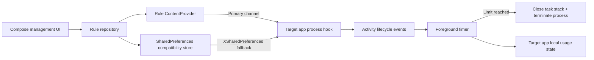

# App Time Limiter (Android / LSPosed)

An Android Xposed module prototype that limits the foreground usage time of selected apps. When an app reaches its configured limit, the module closes its task stack and terminates the process hosting the target UI.

Current version: `0.5.0`

## Features

- Browse and search launchable apps with their real application icons.
- Configure independent daily cumulative and per-launch limits of 1–1,440 minutes for each app; either limit can trigger the exit.
- **Daily cumulative mode:** accumulate foreground usage across multiple launches and reset automatically each day.
- **Per-launch mode:** start a fresh timer whenever the target app's main process starts.
- Count time only while an activity is between `onResume` and `onPause`; background time is paused.
- Reset an app's accumulated usage when its rule is changed.
- Show a warning at the limit, call `finishAffinity()`, and terminate the target app process.
- Show a five-second countdown before the limit and support adding one to ten minutes through a delay action.
- Include diagnostic logs for hook initialization, rule reads, timer events, and limit triggers.
- Provide settings for warnings, diagnostic logging, and the delay duration.
- Include an optional Alipay donation entry.
- Check GitHub Releases for updates and download a newer APK through the system download manager.
- Provide an About page and a feedback action that sends diagnostic logs through the user's mail app.

## Architecture



Key source files:

- `app/src/main/java/com/liuml/apptimelimiter/MainActivity.kt`: app list and rule editor UI.
- `app/src/main/java/com/liuml/apptimelimiter/data/RuleRepository.kt`: rule persistence and cross-process reads.
- `app/src/main/java/com/liuml/apptimelimiter/ipc/RuleProvider.kt`: controlled IPC for reading rules and sending diagnostic logs.
- `app/src/main/java/com/liuml/apptimelimiter/diagnostics/DiagnosticsRepository.kt`: rolling diagnostic log storage.
- `app/src/main/java/com/liuml/apptimelimiter/xposed/AppTimeLimitHook.kt`: lifecycle hooks, timers, daily state, and exit logic.
- `xposed-stubs/`: compile-time Xposed API signatures; they are not packaged into the APK.

## Requirements

- Android device with Root access.
- A working LSPosed framework.
- JDK 17.
- Android SDK 35.

## Build

```powershell
.\gradlew.bat testDebugUnitTest assembleDebug
```

The debug APK is generated at `app/build/outputs/apk/debug/app-debug.apk`.

## Installation and Usage

1. Install the APK on a rooted Android device.
2. Open **App Time Limiter**, select target apps, and save their rules.
3. Enable the module in LSPosed and select only the apps that should be limited in the module scope.
4. Force-stop and reopen each target app. Restart the target process after changing its LSPosed scope.
5. Search for `AppTimeLimiter` in the LSPosed log when diagnosing a setup.

The app does not request camera, storage, notification, or other dangerous runtime permissions. `RECEIVE_BOOT_COMPLETED` is used only to restore URI access after reboot; it does not launch target apps in the background.

## Diagnostics

Open **Diagnostic Logs** from the home screen and check:

- `RULE_SAVED`: the management app saved the rule.
- `HOOK_READY`: the lifecycle hook is running in the target process.
- `RULE_READ ... source=provider`: the primary rule channel is working.
- `RULE_READ ... source=xsharedpreferences`: the compatibility fallback is being used.
- `TIMER_START`: foreground timing has started.
- `LIMIT_REACHED`: the configured limit has been reached and the exit operation was triggered.

If `HOOK_READY` never appears in the in-app log, search the LSPosed log for `AppTimeLimiter: HOOK_INSTALLED` or `HOOK_FAILED`.

The legacy entry point and lifecycle hook use the [Xposed Framework API](https://api.xposed.info/reference/de/robv/android/xposed/IXposedHookLoadPackage.html). New LSPosed projects may migrate to the [Modern Xposed API](https://github.com/LSPosed/LSPosed/wiki/Develop-Xposed-Modules-Using-Modern-Xposed-API).

## Known Limitations

- The Android 15 compatibility path hooks `Instrumentation.callActivityOnResume/Pause` across all processes in the target package.
- Activities that remain resumed in picture-in-picture or split-screen mode continue to count toward the limit.
- Daily usage state is stored in the target app's data area and is reset when that data is cleared.
- A short interval before an unexpected crash may not be persisted if `onPause` is never delivered.
- Only apps with a launcher entry are listed; packages without a desktop entry require future manual package-name configuration.
- Hook behavior cannot be fully verified across different ROMs without a real Root/LSPosed test device.

This tool should be used only by the device owner or on explicitly authorized managed devices. Do not install it covertly or use it for unauthorized monitoring.
