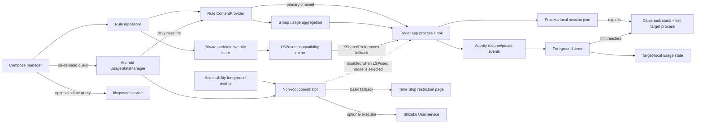

# Time Stop (Android)

Precision app-time control for Android power users who want policy, telemetry, and enforcement in the same loop.

Transition builds: `0.11.13 (52)` legacy migration / `0.11.14 (53)` Modern

## Why Not Just Use Stock Screen Time?

Different Android vendors ship different screen-time features, but the usual model is still broad and UI-driven. Time Stop prefers LSPosed when a current Hook is active and otherwise provides non-root control through accessibility foreground events plus Android usage access.

| Dimension | Stock screen time | Time Stop |
| --- | --- | --- |
| Core model | Usage reports, daily limits, focus modes | Composable enforcement rules for selected apps |
| Time granularity | Mostly daily totals | Daily quota + per-launch timer + post-exit cooldown |
| Schedule logic | Commonly fixed focus windows | Allow-only or block-during weekly windows, multi-day and overnight aware |
| Shared budgets | Rare or vendor-specific | App groups with one shared daily allowance |
| Enforcement path | System blocker or reminder | Countdown plus force exit by default, or an optional standalone Time Stop break page |
| Observability | Usually hidden | Hook heartbeat, rule source, limit hits, and diagnostic logs |
| Runtime | System feature | LSPosed when available, or non-root accessibility + usage access |

Time Stop is not a soft "please stop scrolling" timer. It is a small policy engine for app usage: rules, foreground accounting, warning UI, exit execution, statistics, update checks, and field diagnostics all live in one workflow.

## Feature Highlights

| Capability | What it does |
| --- | --- |
| Independent app rules | Each app keeps its own enabled state, daily quota, per-launch quota, schedule windows, warning style, and cooldown behavior. The launcher-app list refreshes after package changes or returning to Time Stop and also supports pull-to-refresh. |
| App groups and shared rules | Enable shared daily, continuous per-launch, weekly schedule, and cooldown rules for a group. Switching directly between members keeps one per-launch balance; leaving the group for the configured rest starts a new cycle. |
| Child lock and parent override | Optionally protects rule-changing settings with a private 4–8 digit PIN. PIN derivation runs off the UI thread, repeated submissions are suppressed, and an active lockout shows a live countdown instead of freezing or closing the manager. At a hard limit, a parent can temporarily allow only the current app session. |
| Non-root basic protection | Uses content-blind accessibility foreground events and Android usage access. An opt-in enhanced compatibility mode adds package-only content-change events for ROMs that miss normal window events; it still retrieves no nodes, text, or input and adds no foreground service or continuous polling. |
| Global protection mode | Select exactly one controller for all targets: LSPosed, Basic protection, or Basic protection + Shizuku. Controllers never take over automatically. |
| Optional Shizuku enhancement | Only executes a validated force-stop for configured third-party targets; unavailable or failed states fall back to the normal restriction page without switching to LSPosed. |
| Protection status in Settings | Settings shows the selected mode, actual execution path, confirmed issues, and repair actions. Unknown LSPosed evidence is shown as waiting for verification rather than inactive; unavailable Shizuku is shown as a basic-protection fallback. |
| Daily cumulative mode | Uses the stronger source for each app: Android system usage when available, or Hook-local foreground accounting, then resets at local midnight. |
| Per-launch mode | Starts a fresh foreground timer for the target process. If the process survives in the background, staying away for at least the configured cooldown counts as an effective rest and starts a new cycle. |
| Session planning | Optionally asks for a 5, 10, 15, 30, or custom 1–60 minute plan when the target process first opens. Quick choices and a one-minute-step slider share one compact page, while the fixed footer keeps exit and skip actions visible. A choice beyond the earliest remaining quota shows an immediate warning and disables submission; the final submission is revalidated. |
| Weekly schedules | Supports allow-only and block-during windows across multiple weekdays, including overnight ranges. Schedule blocks cannot be bypassed with the delay action. |
| Foreground-only accounting | Counts only the `onResume` to `onPause` phase. Background residency does not burn the quota. |
| Warning UI | LSPosed Hook targets can show a five-second top or full-screen warning matching the selected global color, optionally vibrate once, and offer exit or a 1-60 minute extension. Pure non-root mode hides these Hook-only settings; its session plan offers exit or replan five seconds before expiry. |
| Enforcement mode | Settings expose only actions supported by each engine. LSPosed force-exit closes the task and terminates the current Hook process; separate background processes may survive, while package-wide force-stop requires Standard protection + Shizuku. LSPosed also offers a themed standalone break page with an exit-to-Home action. Non-root basic protection offers the same styled restriction page or Shizuku force-stop, with automatic page fallback if Shizuku is unavailable or fails. |
| Parent temporary override | With child lock enabled, each PIN verification selects 1-60 minutes and defaults to 5 minutes without remembering the previous choice. In the Modern build, switching to another app and returning keeps the override until its fixed deadline; expiry, screen-off, target-process end, or a rule/mode change still invalidates it. |
| Language | Supports system-default, Simplified Chinese, and English UI; Hook warnings use the same preference. |
| Appearance | Offers health green, calm blue, and focus purple across all in-app and target-side surfaces, each with follow-system, light, and dark modes. Plan prompts, full-screen warnings, and restriction pages can also show built-in or custom time-reflection lines. |
| Delay action | Lets the user add 1-60 minutes for normal time limits while keeping schedule blocks strict. |
| Post-exit cooldown | Blocks reopening for 1-1,440 minutes after a daily or per-launch quota event. A group uses one fixed shared cooldown window for all members; repeated openings do not refresh it or inflate limit-hit counts. Schedule denials do not start cooldown. |
| Group sync loop | Grouped foreground apps synchronize daily and per-launch usage every 15 seconds without keeping the manager app alive. Cross-member handoff uses one persisted session and one incident ID. |
| Non-blocking system usage | Daily Android `UsageEvents` are refreshed in the module process and reused as a short-lived snapshot, avoiding a full-day scan on the target app's main thread. |
| Hook and scope status | Registers the API 102 service listener at process creation, reads real scope when available, automatically requests scope for newly managed apps, and removes scope after the last personal or group rule is deleted. Framework confirmation is still required; unsupported frameworks keep the current-version Hook heartbeat fallback. |
| Diagnostics | Logs Hook setup, rule reads, timer starts, sync events, stats writes, and limit exits so configuration problems are traceable. |
| Usage totals | Calculates per-app time from foreground events, clears stale foreground state at screen-off, and deduplicates overlapping intervals for the daily total so it cannot exceed the elapsed part of the day. |
| System-app guardrails | Third-party apps can have their target process terminated; system apps only have their UI closed. |
| Updates and diagnostics | Checks GitHub Releases automatically when the manager opens (rate-limited and configurable), actively prompts for a new stable release, uses Android's download manager for APK updates, and can attach local diagnostics to an email report. |

Changing a rule resets the Hook-local accumulator for that app, but Android's system usage for the current day remains part of the daily baseline when usage access is granted. That makes rule tweaking visible, not a loophole.

## Architecture


```mermaid
flowchart LR
    UI["Compose manager"] --> Repo["Rule repository"]
    Repo --> Provider["Rule ContentProvider"]
    Repo --> Primary["Private authoritative rule store"]
    Primary --> Prefs["LSPosed compatibility mirror"]
    Provider -->|"primary channel"| Hook["Target app process Hook"]
    Provider --> Groups["Group usage aggregation"]
    Groups --> Hook
    Prefs -->|"XSharedPreferences fallback"| Hook
    Hook --> Lifecycle["Activity resume/pause events"]
    Lifecycle --> Timer["Foreground timer"]
    Hook --> SessionPlan["Process-local session plan"]
    SessionPlan -->|"expires"| Exit
    Timer -->|"limit reached"| Exit["Close task stack + exit target process"]
    Timer --> State["Target-local usage state"]
    UI -->|"on-demand query"| UsageStats["Android UsageStatsManager"]
    UsageStats -->|"daily baseline"| Provider
    UI -->|"optional scope query"| XposedService["libxposed service"]
    Accessibility["Accessibility foreground events"] --> Coordinator["Non-root coordinator"]
    UsageStats --> Coordinator
    Coordinator -.->|"disabled when LSPosed mode is selected"| Hook
    Coordinator -->|"basic fallback"| BreakPage["Time Stop restriction page"]
    Coordinator -->|"optional executor"| Shizuku["Shizuku UserService"]
```

Key source files:

- `app/src/main/java/com/liuml/apptimelimiter/MainActivity.kt`: Compose UI, app management, group management, statistics, and settings.
- `app/src/main/java/com/liuml/apptimelimiter/data/RuleRepository.kt`: rule persistence, global settings, groups, and compatibility exports.
- `app/src/main/java/com/liuml/apptimelimiter/ipc/RuleProvider.kt`: controlled IPC for rule reads, diagnostics, statistics, and Hook verification.
- `app/src/main/java/com/liuml/apptimelimiter/statistics/`: Android usage-event calculation and module statistics.
- `app/src/main/java/com/liuml/apptimelimiter/xposed/AppTimeLimitHook.kt`: lifecycle hooks, timers, group sync, cooldowns, warnings, and exit execution.
- `app/src/main/java/com/liuml/apptimelimiter/nonroot/`: non-root sessions under the selected global mode, accessibility overlays, restriction fallback, and restricted Shizuku execution.
- `app/src/main/java/com/liuml/apptimelimiter/core/`: pure policy helpers covered by unit tests.
- `app/src/main/java/com/liuml/apptimelimiter/security/`: private PIN verification, biometric recovery, one-time challenges, and session-bound overrides. PIN material is never mirrored to Hook-readable preferences.
- `xposed-stubs/`: compile-time Xposed API signatures; they are not packaged into the APK.

## Build

Requirements: JDK 17 and Android SDK 37 (`targetSdk` remains 35).

```powershell
.\gradlew.bat testLegacyMigrationDebugUnitTest lintLegacyMigrationDebug assembleLegacyMigrationDebug
.\gradlew.bat testModernDebugUnitTest lintModernDebug assembleModernDebug
```

If Windows path encoding causes Kotlin or JUnit classpath errors, build from a temporary ASCII drive:

```powershell
subst T: "<repo absolute path>"
T:
.\gradlew.bat clean testDebugUnitTest lintDebug assembleDebug
subst T: /d
```

The variant APKs are generated below `app/build/outputs/apk/legacyMigration/debug/` and
`app/build/outputs/apk/modern/debug/`.

## Installation

1. Install the APK, open **Time Stop**, select target apps, and save rules or groups.
2. For non-root protection, enable it in Settings, accept the accessibility disclosure, and grant accessibility plus usage access.
3. Select one global protection mode. Basic protection requires Accessibility and Usage Access; the Shizuku mode additionally requires Shizuku authorization. Protection status and repair actions are shown at the top of Settings. After switching modes, the next real target-app window is owned by the new mode; only confirmed outdated or failed Hooks require a targeted reopen.
4. On rooted devices, enable the LSPosed module and scope controlled apps. Force-stop and reopen targets after changing scope; a current Hook heartbeat automatically takes priority.

Time Stop checks required non-root permissions only when non-root mode has managed targets. Choosing Later suppresses the same issue combination for 72 hours, while “Do not show this type again” suppresses that signature until reminders are restored in Settings. Missing Shizuku capability never disables basic timing; enforcement falls back to the standalone restriction page.

Upgrade legacy installations through `0.11.13 (52)` before installing `0.11.14 (53)`. Version 52 contains only `assets/xposed_init`; while the legacy LSPosed store is still authoritative it writes an AES-GCM encrypted capsule into app-private, no-backup storage and refreshes it after configuration or child-lock changes. Once that capsule is valid, every cold start offers the exact 0.11.14 release again. Version 53 imports the capsule before initializing Modern remote preferences or scope synchronization, then retains the consumed capsule for 30 days. If a user upgrades directly from an older version to 53 and the legacy authoritative store is still readable, 53 adopts it once and continues without requiring a data wipe. If legacy data is detected but cannot be confirmed, initialization stops rather than replacing rules with an empty store.

Settings also provides a portable plaintext JSON export/import flow through Android's document picker. It previews and validates the file before atomically replacing app and group rules, preserves rules for apps not currently installed, and keeps device-specific protection settings and child lock unchanged. Portable backups contain package names and time rules, but never PIN material, statistics, diagnostics, runtime cooldowns, challenges, or temporary overrides.

On frameworks that expose API 102 service access, Time Stop registers its listener when the manager process is created, reads scope before a target app opens, automatically requests missing packages after a personal rule or active group is saved, and removes packages after their last effective rule is deleted. LSPosed still shows its own approval UI, and running targets must be force-stopped and reopened after a scope change. Older or temporarily disconnected frameworks fall back to the persisted `HOOK_READY` heartbeat without reporting an unknown scope as missing.

## Distribution

### GitHub Releases

The official APK is published from the LSPosed mirror repository:

<https://github.com/Xposed-Modules-Repo/com.liuml.apptimelimiter/releases/latest>

### Obtainium

Time Stop works with Obtainium by tracking GitHub Releases:

- App source URL: `https://github.com/Xposed-Modules-Repo/com.liuml.apptimelimiter`
- Source type: GitHub Releases
- APK asset pattern: `app-time-limiter-v*.apk`

Obtainium is a third-party updater. It does not change Time Stop's protection engine; it only checks the release page and installs the APK selected by the user.

### F-Droid

Time Stop is licensed as GPL-3.0-only so it can be submitted to F-Droid-compatible repositories. Packaging metadata is kept in `packaging/fdroid/`. Until the official F-Droid review is accepted, use GitHub Releases, LSPosed, Obtainium, or a self-hosted F-Droid repository.

## Diagnostics

Open **Diagnostic Logs** from the home screen and check:

- `RULE_SAVED`: the manager saved the rule.
- `HOOK_READY`: the lifecycle Hook is running in the target process.
- `RULE_READ ... source=provider`: the primary rule channel is working.
- `RULE_READ ... source=xsharedpreferences`: the compatibility fallback is being used.
- `TIMER_START`: foreground timing has started.
- `SESSION_PLAN_PROMPT/STARTED/REPLANNED/SKIPPED/EXPIRED` and `SESSION_PLAN_PROMPT_INTERRUPTED`: lifecycle of the process-local session plan.
- `EXTERNAL_BREAK_PAGE_SHOWN/UPDATED/REMOVED/FAILED`: standalone break-page display, rule changes, recovery, and safe-exit fallback.
- `MEDIA_PAUSE_ATTEMPT/MEDIA_PAUSE_FAILED`: best-effort pause result for common platform, ExoPlayer/Media3, and web media.
- `REST_CYCLE_RESUMED`: a per-launch break ended and a fresh foreground cycle started.
- `PER_LAUNCH_REST_RESET`: the target stayed genuinely in the background for the configured cooldown and returned in a fresh per-launch cycle.
- `GROUP_COOLDOWN_STARTED/REUSED/EXPIRED` and `QUOTA_INCIDENT_DUPLICATE`: shared group cooldown ownership, reuse, expiry, and duplicate suppression.
- `SESSION_PLAN_WAITING_USAGE`, `SESSION_PLAN_REJECTED_OVER_QUOTA`, and `SESSION_PLAN_UNAVAILABLE`: authoritative usage wait, over-quota rejection, or plan unavailability.
- `SESSION_PLAN_SUPPRESSED_BLOCKED`: a schedule, cooldown, or exhausted quota correctly prevented the plan dialog.
- `COOLDOWN_STARTED/COOLDOWN_PERSIST_FAILED`: cooldown persistence after a quota limit.
- `LIMIT_REACHED`: a configured boundary was reached and exit execution started.
- `EXIT_REENTRY_DETECTED` and `EXIT_RECOVERY_RECHECK`: a system app was relaunched from Home, a launcher feed, or another external entry after UI-only exit; the new Activity is closed and any still-resumed Activity is revalidated when the recovery window ends.
- `PROTECTION_MODE_CHANGED`, `HOOK_MODE_ACKNOWLEDGED`, and `PROTECTION_STATUS_DEGRADED`: selected-mode changes, Hook mode-generation acknowledgement, and protection-health degradation.
- `NON_ROOT_RESTRICTION_REENTRY` and `NON_ROOT_RESTRICTION_STATE_PERSIST_FAILED`: fast restriction revalidation after reopening a target and failures to persist its re-entry marker.
- `NON_ROOT_BREAK_PAGE_START_REQUESTED`, `NON_ROOT_BREAK_PAGE_START_ACCEPTED`, `NON_ROOT_BREAK_PAGE_CONFIRMED`, and `NON_ROOT_BREAK_PAGE_CONFIRM_TIMEOUT`: distinguish a launch request, Android accepting it, the page actually gaining foreground focus, and silent vendor-ROM blocking.
- `NON_ROOT_OVERLAY_ADD_REQUESTED`, `NON_ROOT_OVERLAY_ADD_ACCEPTED`, `NON_ROOT_OVERLAY_ATTACH_STATE`, and `NON_ROOT_OVERLAY_ADD_FAILED`: capture session-plan overlay window parameters, attachment state, and the full exception type.
- `NON_ROOT_FOREGROUND_SIGNAL`, `NON_ROOT_FOREGROUND_RECONCILED`, and `NON_ROOT_FOREGROUND_MISMATCH`: record the accepted accessibility source and bounded UsageStats reconciliation before protection UI is shown.
- `NON_ROOT_OVERLAY_DETACHED`, `NON_ROOT_OVERLAY_REATTACHED`, and `NON_ROOT_UI_STATE_CHANGED`: record bounded session-plan overlay recovery and the single-owner non-root UI state.
- `SHIZUKU_FORCE_STOP` and `NON_ROOT_HOME_FALLBACK_RESULT`: report enhanced force-stop execution and the final foreground state after the Home fallback.

If `HOOK_READY` never appears in the in-app log, search LSPosed logs for `AppTimeLimiter: HOOK_INSTALLED` or `HOOK_FAILED`.

`HOOK_INSTALLED` and `HOOK_READY` include the target process bitness and ABI. If neither appears for only a few apps, first check whether those apps are excluded by the Magisk denylist/Zygisk configuration. The Hook uses both the normal Instrumentation lifecycle path and an Activity lifecycle fallback for protected or legacy apps.

The lifecycle Hook remains on the [legacy Xposed Framework API](https://api.xposed.info/reference/de/robv/android/xposed/IXposedHookLoadPackage.html). The manager optionally uses libxposed service API 102 for framework, scope, and running-target status without adding a second modern Hook entry; unsupported frameworks automatically retain heartbeat verification.

## Known Limitations

- Non-root protection is self-management, not tamper-resistant parental control. Revoking permissions, force-stopping Time Stop, or uninstalling it stops this path.
- A non-root per-launch session survives up to 30 seconds away from the target. Returning within that grace resumes its timer and plan; returning later starts a new session.
- Basic enforcement opens the standalone restriction page directly so the target Activity pauses and may resume when the restriction clears. It returns Home only if the page cannot open. The target process stays alive, so background media may continue. Shizuku force-stop discards the current page and commonly must be restarted after a reboot.
- While a persistent non-root restriction remains active, reopening the target from Home immediately revalidates the current rule and restores the restriction page without waiting for the Hook handshake. This marker only accelerates revalidation and cannot override a changed or cleared rule.
- Non-root mode hides scope, Hook verification, reopen actions, and historical counter prompts. Accessibility is reported as disabled, enabled-but-disconnected, or connected, and global permission failures are not repeated for every app. LSPosed treats an in-scope idle app as ready without waiting for a heartbeat.
- Launcher and launcher-folder windows are hard foreground boundaries: they pause timing with the existing 30-second grace period, cancel stale enforcement callbacks, and never issue navigation, overlays, Toasts, or another Home action.
- Some vendor ROMs omit Activity pause events. The statistics calculator clears stale foreground state at screen-off and waits for a new foreground event after wake, preventing multiple apps from replaying the same screen-on intervals; small errors remain possible when vendor events are missing.
- The non-root restriction page uses a separate task, so it cannot cover the Time Stop manager when the user opens Time Stop from the launcher.
- The standalone restriction Activity is the enforcement surface because it naturally pauses the target Activity. Accessibility overlays are reserved for the session-plan picker and short warnings: an overlay can block touches but cannot reliably pause media, games, or the target lifecycle.
- Enhanced compatibility detection is off by default. It only uses the package name attached to content-change events, keeps `canRetrieveWindowContent=false`, and confirms ambiguous signals with a one-shot recent UsageStats query.
- The accessibility service retrieves no window content, nodes, text, accounts, input, or notifications. Foreground package changes and local timing or diagnostics are not uploaded.
- Exit-reentry diagnostics record only the target Activity class, component, Intent action, referrer host, process, and PID. Intent URIs, search queries, and page content are not recorded.

- Session planning is process-local: it is offered once per target process, survives Activity changes in that process, and is cleared when the process ends.
- A session plan counts only resumed foreground Activity time. Background and screen-off time is paused by design; this feature does not provide background media playback or a wall-clock sleep timer.
- Session-plan expiry does not add a limit hit or start cooldown. System apps only have their UI closed.
- A session plan must fit within the earliest remaining app or group time quota. Longer choices are rejected with the available balance, and exhausted quotas, cooldowns, or blocked schedules can never be bypassed.
- The standalone break page pauses the target Activity and attempts to pause common MediaPlayer, ExoPlayer/Media3, and web media. Vendor ROMs may ask before opening Time Stop. Custom players, background services, rendering, or game logic may continue; use force-exit mode when execution must stop completely.
- Rules, statistics, diagnostics, and runtime state are excluded from Android backup and device transfer.
- Per-launch and group per-launch limits start a fresh cycle after configured cooldown. In LSPosed mode, voluntarily staying in the background for the full configured cooldown also counts as an effective rest even if the target process survives; shorter app switches continue the old cycle. Daily and group-daily quotas remain hard limits until the daily reset, and blocked schedules remain active until the allowed period.
- While the standalone page is visible, the target Activity is paused, so Hook-local foreground accumulation also pauses. Playback is never force-resumed by the module.

- Lifecycle tracking uses `Instrumentation.callActivityOnResume/Pause` with a deduplicated `Activity.onResume/onPause` fallback across target processes; diagnostics show the process and bitness that host the UI.
- Already running target apps keep the old Hook after install or upgrade. Force-stop and reopen them to load the new module code. The manager only prompts when the current runtime state is definitively abnormal.
- Activities that remain resumed in picture-in-picture or split-screen mode continue to count toward the limit.
- Multiple resumed apps in the same group synchronize increments every 15 seconds, so concurrent multi-window use can exceed the shared allowance by up to one sync interval.
- Every group member must still be in LSPosed scope. Compatible frameworks can approve missing scope from Time Stop; older frameworks require manual selection. An unhooked member can count toward shared usage through Android usage stats, but cannot execute its own forced exit.

- The Hook-local daily fallback is stored in the target app's data area. If that data is cleared while usage access remains granted, Android's system usage can still restore the daily baseline.
- A short segment before an unexpected crash may not be persisted if `onPause` is never delivered.
- Only launchable apps are listed. Packages without launcher entries need future manual package-name configuration.
- The app list only shows apps in the Android user that hosts the manager. Work-profile or cloned-user instances are not separately controlled yet because rules and statistics are currently keyed by package name.
- Hook behavior cannot be fully verified across ROMs without a real Root/LSPosed device.

This tool should be used only by the device owner or on explicitly authorized managed devices. Do not install it covertly or use it for unauthorized monitoring.

## License and copyright

Time Stop is free software licensed under GPL-3.0-only. You may use, study, modify, and
redistribute it under the terms of the GNU General Public License version 3 only. See
[LICENSE](LICENSE) for the complete terms. Third-party components remain under their respective
licenses.
