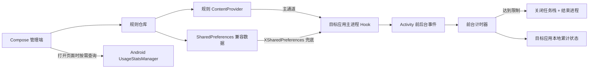

# 时停

> 把时间留给真正重要的事。


**时停**是一款面向 Android / LSPosed 的应用使用时长管控模块。你可以为容易让人沉迷或需要规律使用的应用设置每日额度、单次时长和可用时段；限制到达后，时停会提醒并退出目标应用，帮你把“再刷一会儿”变成清晰、可执行的边界。

[下载最新版本](https://github.com/Xposed-Modules-Repo/com.liuml.apptimelimiter/releases/latest) · [LSPosed 模块页面](https://modules.lsposed.org/module/com.liuml.apptimelimiter/) · [English documentation](README.en.md)

当前版本：`0.8.0`

## 为什么选择时停

- **限制方式灵活**：每日累计、单次打开、每周时段可以独立使用，也可以组合生效。
- **管控边界明确**：到期前倒计时提醒，到达限制后关闭任务栈并结束目标应用界面所在进程。
- **统计清晰克制**：首页展示 Hook 状态、已管控应用数和今日使用时长，仅在打开页面时按需读取系统统计。
- **不依赖后台常驻**：不轮询、不启动常驻服务，规则和统计都以轻量方式在本地处理。
- **问题容易排查**：内置诊断日志，可确认 Hook、规则读取、计时和限制触发是否正常。

## 核心功能

| 能力 | 说明 |
| --- | --- |
| 每日累计限制 | 为每个应用设置 1–1440 分钟的每日额度，多次打开会累计，次日自动重置。 |
| 单次打开限制 | 每次目标应用主进程启动后重新计时，适合控制一次连续使用的时长。 |
| 每周时段规则 | 支持“仅指定时段允许”和“指定时段禁止”，可组合多个星期并覆盖跨午夜时段。 |
| 到期提醒与延时 | 到期前 5 秒显示倒计时，可按设置临时延长 1–60 分钟；时段禁用规则不能被延时绕过。 |
| 使用统计 | 首页和统计页按需读取 Android `UsageStatsManager`，展示今日时长、启动次数和限制触发次数。 |
| Hook 状态验证 | 仪表盘根据真实 Hook 心跳判断模块是否已经在目标应用中生效。 |
| 隐藏桌面入口 | 可隐藏启动图标，并通过 LSPosed 模块页或 `apptimelimiter://settings` 恢复进入设置。 |
| 更新与反馈 | 可检查 GitHub Releases、调用系统下载管理器更新，并通过邮件附带诊断日志反馈问题。 |

计时仅覆盖 `Activity.onResume` 到 `Activity.onPause` 的前台阶段，切到后台会暂停。修改规则时会重置该应用在旧规则下的累计用量。

## 架构



主要代码：

- `app/src/main/java/com/liuml/apptimelimiter/MainActivity.kt`：应用列表和规则编辑界面。
- `app/src/main/java/com/liuml/apptimelimiter/data/RuleRepository.kt`：规则存储与跨进程可读处理。
- `app/src/main/java/com/liuml/apptimelimiter/ipc/RuleProvider.kt`：目标进程读取规则和回传日志的受控 IPC 通道。
- `app/src/main/java/com/liuml/apptimelimiter/diagnostics/DiagnosticsRepository.kt`：滚动诊断日志。
- `app/src/main/java/com/liuml/apptimelimiter/xposed/AppTimeLimitHook.kt`：生命周期 Hook、计时、每日状态和退出逻辑。
- `app/src/main/java/com/liuml/apptimelimiter/core/ScheduleEvaluator.kt`：每周时段匹配、跨午夜处理和下一访问边界计算。
- `xposed-stubs/`：只用于编译的传统 Xposed API 签名，不会打包进 APK。

## 构建

环境要求：JDK 17、Android SDK 35。

```powershell
.\gradlew.bat testDebugUnitTest assembleDebug
```

当前工作区路径含中文；如果 Windows 上单元测试报 `ClassNotFoundException`，可临时映射英文盘符：

```powershell
subst T: "<你的项目目录>"
T:
.\gradlew.bat testDebugUnitTest assembleDebug
subst T: /d
```

调试 APK 输出到 `app/build/outputs/apk/debug/app-debug.apk`。

## 安装和使用

1. 设备需已 Root，并安装可用的 LSPosed 框架。
2. 安装 APK，打开“时停”，选择目标应用并保存规则。
3. 进入 LSPosed，启用本模块，在作用域中只勾选需要限制的应用。
4. 强制停止目标应用后重新打开。修改 LSPosed 作用域后同样需要重启目标应用进程。
5. 调试时可在 LSPosed 日志中搜索 `AppTimeLimiter`。

## 诊断日志判断方法

在首页点击“诊断日志”，重点查看以下事件：

- 只有 `RULE_SAVED`：管理端保存成功，但 Hook 没有进入目标应用；检查 LSPosed 模块开关、目标应用作用域，并强制停止目标应用后重开。
- 出现 `HOOK_READY`：生命周期 Hook 已经运行。
- `RULE_READ ... source=provider`：新版规则通道工作正常。
- `RULE_READ ... source=xsharedpreferences`：Provider 不可用，正在走旧兼容通道；这通常是系统包可见性或 ROM 限制。
- `TIMER_START`：前台计时已开始，日志会显示剩余秒数。
- `LIMIT_REACHED`：限制已达到，代码已发出关闭任务栈和结束进程操作。

如果应用内日志完全没有 `HOOK_READY`，还可以在 LSPosed 日志中搜索 `AppTimeLimiter: HOOK_INSTALLED` 或 `HOOK_FAILED`。

传统入口与生命周期 Hook 使用 [Xposed Framework API](https://api.xposed.info/reference/de/robv/android/xposed/IXposedHookLoadPackage.html)。LSPosed 的新项目可进一步迁移到 [Modern Xposed API](https://github.com/LSPosed/LSPosed/wiki/Develop-Xposed-Modules-Using-Modern-Xposed-API)，以 Remote Preferences 替代当前兼容层。

## 已知限制

- Android 15 兼容路径使用 `Instrumentation.callActivityOnResume/Pause`，并覆盖目标包的所有进程；日志会显示实际承载界面的进程名。
- 画中画、分屏状态下，只要 Activity 保持 Resume 就会继续计时。
- 每日累计状态保存在目标应用数据区；清除目标应用数据会重置累计时间。
- 目标应用或系统崩溃时，最后一个尚未触发 `onPause` 的短时间片可能没有持久化。
- 应用列表只查询带 Launcher 入口的软件；没有桌面入口的包暂不显示，需要在后续版本增加手动包名配置。
- 未连接真实 Root/LSPosed 设备时，只能完成编译、单元测试和 APK 结构校验，不能验证不同 ROM 的 Hook 行为。

本工具应仅用于设备所有者本人或已明确授权的受管设备，不应隐蔽安装或用于未经同意的监控。
