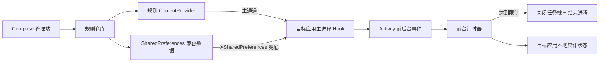

# 应用计时退出（Android / LSPosed）

这是一个可运行的 Android Xposed 模块原型：为指定应用设置前台可使用时长，达到限制后先关闭任务栈，再结束目标应用界面所在进程。当前版本为 `0.4.1`。

## 已实现

- 展示应用真实图标，并可搜索设备上的可启动应用。
- 为每个应用设置 1–1440 分钟限制。
- **每日累计**：当天多次打开累计前台时长，第二天自动重置；超限后当天再次打开会立即退出。
- **单次打开**：目标应用每次主进程启动后重新计时。
- 仅在 `Activity.onResume` 到 `Activity.onPause` 之间计时，切到后台时暂停。
- 修改规则会重置该应用原规则下的累计用量。
- 达到阈值后显示提示，调用 `finishAffinity()`，随后结束目标应用进程。
- 首次启动主动说明 Root、LSPosed、模块作用域等运行要求。
- 内置诊断日志，可查看 Hook、规则读取、计时开始/暂停和退出触发事件。
- 顶部“设置”入口可开关退出提醒、开关诊断日志，并配置每次点击延时 1–60 分钟。
- 到期前 5 秒在目标应用内显示倒计时；点击延时后追加本次额度，并在新截止点前再次提醒。
- 设置页提供支付宝捐赠入口，尝试跳转到 `liuml.yx@139.com` 的账户转账页；不支持直接跳转时复制账号并打开支付宝。

## 架构



主要代码：

- `app/src/main/java/com/liuml/apptimelimiter/MainActivity.kt`：应用列表和规则编辑界面。
- `app/src/main/java/com/liuml/apptimelimiter/data/RuleRepository.kt`：规则存储与跨进程可读处理。
- `app/src/main/java/com/liuml/apptimelimiter/ipc/RuleProvider.kt`：目标进程读取规则和回传日志的受控 IPC 通道。
- `app/src/main/java/com/liuml/apptimelimiter/diagnostics/DiagnosticsRepository.kt`：滚动诊断日志。
- `app/src/main/java/com/liuml/apptimelimiter/xposed/AppTimeLimitHook.kt`：生命周期 Hook、计时、每日状态和退出逻辑。
- `xposed-stubs/`：只用于编译的传统 Xposed API 签名，不会打包进 APK。

## 跨平台方案

“规则管理”可以跨平台，“Hook 任意应用并结束其进程”不能跨平台。建议正式版按以下边界拆分：

| 层 | Android | iOS | 可共享性 |
|---|---|---|---|
| 规则模型、时长计算、同步协议 | Kotlin | Kotlin/Swift | 可放入 Kotlin Multiplatform `shared` 模块 |
| 管理界面 | Compose Android 或 Compose Multiplatform | SwiftUI/Compose | 可部分共享 |
| 使用时长监控 | LSPosed Hook；非 Root 版可用 UsageStats/无障碍做弱化方案 | DeviceActivity | 平台实现 |
| 到时限制 | Root/LSPosed 可结束目标进程 | ManagedSettings Shield | 完全不同 |

iOS 不允许第三方应用 Hook 或强杀任意应用。合规实现需要 Apple 的 Family Controls、Device Activity 和 Managed Settings，并申请 Family Controls entitlement；效果是到时显示系统 Shield，而不是结束进程。参考 [Apple Screen Time API](https://developer.apple.com/documentation/ScreenTimeAPIDocumentation) 和 [Family Controls 配置](https://developer.apple.com/documentation/Xcode/configuring-family-controls)。

因此推荐产品路线：

1. 先发布当前 Android Root/LSPosed 专用版，验证计时规则和用户体验。
2. 抽取 `AppRule`、计时策略、规则同步 DTO 到 KMP `shared`。
3. 增加 Android 非 Root 版，只做 UsageStats 统计和提醒/遮罩，能力弱于 Hook 版。
4. 如需 iOS，再单独实现 Family Controls 扩展，不承诺“强制退出”。

## 构建

环境要求：JDK 17、Android SDK 35。

```powershell
.\gradlew.bat testDebugUnitTest assembleDebug
```

当前工作区路径含中文；如果 Windows 上单元测试报 `ClassNotFoundException`，可临时映射英文盘符：

```powershell
subst T: "<你的项目目录>"
T:
.\gradlew.bat testDebugUnitTest assembleDebug
subst T: /d
```

调试 APK 输出到 `app/build/outputs/apk/debug/app-debug.apk`。

## 安装和使用

1. 设备需已 Root，并安装可用的 LSPosed 框架。
2. 安装 APK，打开“应用计时退出”，选择目标应用并保存规则。
3. 进入 LSPosed，启用本模块，在作用域中只勾选需要限制的应用。
4. 强制停止目标应用后重新打开。修改 LSPosed 作用域后同样需要重启目标应用进程。
5. 调试时可在 LSPosed 日志中搜索 `AppTimeLimiter`。

应用不需要相机、存储、通知等危险运行时权限。Manifest 中的 `RECEIVE_BOOT_COMPLETED` 是普通权限，仅用于手机重启后恢复目标应用访问规则 Provider 的 URI 授权，不会在后台启动目标应用。

## 诊断日志判断方法

在首页点击“诊断日志”，重点查看以下事件：

- 只有 `RULE_SAVED`：管理端保存成功，但 Hook 没有进入目标应用；检查 LSPosed 模块开关、目标应用作用域，并强制停止目标应用后重开。
- 出现 `HOOK_READY`：生命周期 Hook 已经运行。
- `RULE_READ ... source=provider`：新版规则通道工作正常。
- `RULE_READ ... source=xsharedpreferences`：Provider 不可用，正在走旧兼容通道；这通常是系统包可见性或 ROM 限制。
- `TIMER_START`：前台计时已开始，日志会显示剩余秒数。
- `LIMIT_REACHED`：限制已达到，代码已发出关闭任务栈和结束进程操作。

如果应用内日志完全没有 `HOOK_READY`，还可以在 LSPosed 日志中搜索 `AppTimeLimiter: HOOK_INSTALLED` 或 `HOOK_FAILED`。

传统入口与生命周期 Hook 使用 [Xposed Framework API](https://api.xposed.info/reference/de/robv/android/xposed/IXposedHookLoadPackage.html)。LSPosed 的新项目可进一步迁移到 [Modern Xposed API](https://github.com/LSPosed/LSPosed/wiki/Develop-Xposed-Modules-Using-Modern-Xposed-API)，以 Remote Preferences 替代当前兼容层。

## 已知限制

- Android 15 兼容路径使用 `Instrumentation.callActivityOnResume/Pause`，并覆盖目标包的所有进程；日志会显示实际承载界面的进程名。
- 画中画、分屏状态下，只要 Activity 保持 Resume 就会继续计时。
- 每日累计状态保存在目标应用数据区；清除目标应用数据会重置累计时间。
- 目标应用或系统崩溃时，最后一个尚未触发 `onPause` 的短时间片可能没有持久化。
- 应用列表只查询带 Launcher 入口的软件；没有桌面入口的包暂不显示，需要在后续版本增加手动包名配置。
- 未连接真实 Root/LSPosed 设备时，只能完成编译、单元测试和 APK 结构校验，不能验证不同 ROM 的 Hook 行为。

本工具应仅用于设备所有者本人或已明确授权的受管设备，不应隐蔽安装或用于未经同意的监控。
