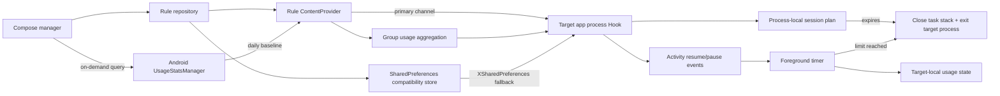
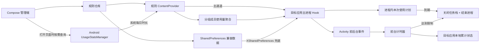

# Time Stop

> Precision app-time control for Android power users who want policy, telemetry, and enforcement in the same loop.


Stock screen-time tools are usually built for reports, daily caps, and focus modes. **Time Stop** is built for people who want sharper controls: per-app quotas, per-launch timers, weekly allow/block windows, shared group budgets, cooldowns after forced exits, Hook verification, and diagnostics that show what is actually happening inside the target process.

[Latest release](https://github.com/Xposed-Modules-Repo/com.liuml.apptimelimiter/releases/latest) · [LSPosed module page](https://modules.lsposed.org/module/com.liuml.apptimelimiter/) · [中文说明](#中文说明)

Current version: `0.9.4`

## Why Not Just Use Stock Screen Time?

Different Android vendors ship different screen-time features, but the usual model is still broad and UI-driven. Time Stop leans into LSPosed: the rule engine runs inside the target app process, counts foreground time from lifecycle events, and can close the task when a boundary is hit.

| Dimension | Stock screen time | Time Stop |
| --- | --- | --- |
| Core model | Usage reports, daily limits, focus modes | Composable enforcement rules for selected apps |
| Time granularity | Mostly daily totals | Daily quota + per-launch timer + post-exit cooldown |
| Schedule logic | Commonly fixed focus windows | Allow-only or block-during weekly windows, multi-day and overnight aware |
| Shared budgets | Rare or vendor-specific | App groups with one shared daily allowance |
| Enforcement path | System blocker or reminder | Countdown, task close, and target-process exit for third-party apps |
| Observability | Usually hidden | Hook heartbeat, rule source, limit hits, and diagnostic logs |
| Runtime | System feature | Root + LSPosed, executing in target app processes |

Time Stop is not a soft "please stop scrolling" timer. It is a small policy engine for app usage: rules, foreground accounting, warning UI, exit execution, statistics, update checks, and field diagnostics all live in one workflow.

## Feature Highlights

| Capability | What it does |
| --- | --- |
| Independent app rules | Each app keeps its own enabled state, daily quota, per-launch quota, schedule windows, warning style, and cooldown behavior. |
| App groups and shared allowance | Put multiple apps into one group with a shared 1-1,440 minute daily budget. App-level daily, per-launch, and schedule rules still run in parallel; the first threshold wins. |
| Daily cumulative mode | Uses the stronger source for each app: Android system usage when available, or Hook-local foreground accounting, then resets at local midnight. |
| Per-launch mode | Starts a fresh timer when the target app's main process begins a foreground session. |
| Session planning | Optionally asks for a 5, 10, 15, 30, or custom 1-1,440 minute plan when the target process first opens. It counts foreground time only and may be skipped or replanned. A plan longer than the earliest remaining timed quota is rejected with the available balance. |
| Weekly schedules | Supports allow-only and block-during windows across multiple weekdays, including overnight ranges. Schedule blocks cannot be bypassed with the delay action. |
| Foreground-only accounting | Counts only the `onResume` to `onPause` phase. Background residency does not burn the quota. |
| Warning UI | Shows a five-second top banner or opt-in full-screen warning, with an optional one-shot long vibration and layout handling for portrait, landscape, display cutouts, and immersive apps. |
| Language | Supports system-default, Simplified Chinese, and English UI; Hook warnings use the same preference. |
| Delay action | Lets the user add 1-60 minutes for normal time limits while keeping schedule blocks strict. |
| Post-exit cooldown | Blocks reopening for 1-1,440 minutes after a daily, per-launch, or shared-group quota exit. Schedule denials keep showing their stable next-available time and do not start cooldown. Repeated attempts do not refresh cooldown or inflate limit-hit counts. |
| Group sync loop | Grouped foreground apps synchronize usage every 15 seconds without keeping the manager app alive. |
| Hook verification | Persists current-version Hook verification per controlled app and warns immediately when a newly controlled app or group member has not reported back. |
| Diagnostics | Logs Hook setup, rule reads, timer starts, sync events, stats writes, and limit exits so configuration problems are traceable. |
| System-app guardrails | Third-party apps can have their target process terminated; system apps only have their UI closed. |
| Updates and feedback | Checks GitHub Releases, uses Android's download manager for APK updates, and offers email diagnostics or QQ group `1009712674` for feedback and beta participation. |

Changing a rule resets the Hook-local accumulator for that app, but Android's system usage for the current day remains part of the daily baseline when usage access is granted. That makes rule tweaking visible, not a loophole.

## Architecture



Key source files:

- `app/src/main/java/com/liuml/apptimelimiter/MainActivity.kt`: Compose UI, app management, group management, statistics, and settings.
- `app/src/main/java/com/liuml/apptimelimiter/data/RuleRepository.kt`: rule persistence, global settings, groups, and compatibility exports.
- `app/src/main/java/com/liuml/apptimelimiter/ipc/RuleProvider.kt`: controlled IPC for rule reads, diagnostics, statistics, and Hook verification.
- `app/src/main/java/com/liuml/apptimelimiter/statistics/`: Android usage-event calculation and module statistics.
- `app/src/main/java/com/liuml/apptimelimiter/xposed/AppTimeLimitHook.kt`: lifecycle hooks, timers, group sync, cooldowns, warnings, and exit execution.
- `app/src/main/java/com/liuml/apptimelimiter/core/`: pure policy helpers covered by unit tests.
- `xposed-stubs/`: compile-time Xposed API signatures; they are not packaged into the APK.

## Build

Requirements: JDK 17 and Android SDK 35.

```powershell
.\gradlew.bat testDebugUnitTest lintDebug assembleDebug
```

If Windows path encoding causes Kotlin or JUnit classpath errors, build from a temporary ASCII drive:

```powershell
subst T: "<repo absolute path>"
T:
.\gradlew.bat clean testDebugUnitTest lintDebug assembleDebug
subst T: /d
```

The debug APK is generated at `app/build/outputs/apk/debug/app-debug.apk`.

## Installation

1. Use a rooted Android device with a working LSPosed framework.
2. Install the APK, open **Time Stop**, select target apps, and save rules or groups.
3. Enable the module in LSPosed and scope it only to the apps that should be controlled.
4. Force-stop and reopen each target app. Do the same after changing LSPosed scope.
5. Search for `AppTimeLimiter` in LSPosed logs when diagnosing setup issues.

When a newly enabled rule or group member has not returned a current-version Hook record yet, Time Stop prompts you to check LSPosed scope and restart the target app. Legacy modules cannot read LSPosed scope directly from the manager UI, so "Hook verified" means the target app has successfully loaded this module version before.

## Diagnostics

Open **Diagnostic Logs** from the home screen and check:

- `RULE_SAVED`: the manager saved the rule.
- `HOOK_READY`: the lifecycle Hook is running in the target process.
- `RULE_READ ... source=provider`: the primary rule channel is working.
- `RULE_READ ... source=xsharedpreferences`: the compatibility fallback is being used.
- `TIMER_START`: foreground timing has started.
- `SESSION_PLAN_PROMPT/STARTED/REPLANNED/SKIPPED/EXPIRED`: lifecycle of the process-local session plan.
- `SESSION_PLAN_WAITING_USAGE`, `SESSION_PLAN_REJECTED_OVER_QUOTA`, and `SESSION_PLAN_UNAVAILABLE`: authoritative usage wait, over-quota rejection, or plan unavailability.
- `LIMIT_REACHED`: a configured boundary was reached and exit execution started.

If `HOOK_READY` never appears in the in-app log, search LSPosed logs for `AppTimeLimiter: HOOK_INSTALLED` or `HOOK_FAILED`.

`HOOK_INSTALLED` and `HOOK_READY` include the target process bitness and ABI. If neither appears for only a few apps, first check whether those apps are excluded by the Magisk denylist/Zygisk configuration. The Hook uses both the normal Instrumentation lifecycle path and an Activity lifecycle fallback for protected or legacy apps.

The legacy entry point and lifecycle Hook use the [Xposed Framework API](https://api.xposed.info/reference/de/robv/android/xposed/IXposedHookLoadPackage.html). New LSPosed projects may migrate to the [Modern Xposed API](https://github.com/LSPosed/LSPosed/wiki/Develop-Xposed-Modules-Using-Modern-Xposed-API) and Remote Preferences later.

## Known Limitations

- Session planning is process-local: it is offered once per target process, survives Activity changes in that process, and is cleared when the process ends.
- A session plan counts only resumed foreground Activity time. Background and screen-off time is paused by design; this feature does not provide background media playback or a wall-clock sleep timer.
- Session-plan expiry does not add a limit hit or start cooldown. System apps only have their UI closed.
- A session plan must fit within the earliest remaining app or group timed quota. Longer choices are rejected with the available balance, and exhausted quotas, cooldowns, or blocked schedules can never be bypassed.

- Lifecycle tracking uses `Instrumentation.callActivityOnResume/Pause` with a deduplicated `Activity.onResume/onPause` fallback across target processes; diagnostics show the process and bitness that host the UI.
- Already running target apps keep the old Hook after install or upgrade. Force-stop and reopen them to load the new module code.
- Activities that remain resumed in picture-in-picture or split-screen mode continue to count toward the limit.
- Multiple resumed apps in the same group synchronize increments every 15 seconds, so concurrent multi-window use can exceed the shared allowance by up to one sync interval.
- Group members still need to be manually added to LSPosed scope. An unhooked member can count toward shared usage through Android usage stats, but cannot execute its own forced exit.
- The Hook-local daily fallback is stored in the target app's data area. If that data is cleared while usage access remains granted, Android's system usage can still restore the daily baseline.
- A short segment before an unexpected crash may not be persisted if `onPause` is never delivered.
- Only launchable apps are listed. Packages without launcher entries need future manual package-name configuration.
- The app list only shows apps in the Android user that hosts the manager. Work-profile or cloned-user instances are not separately controlled yet because rules and statistics are currently keyed by package name.
- Hook behavior cannot be fully verified across ROMs without a real Root/LSPosed device.

This tool should be used only by the device owner or on explicitly authorized managed devices. Do not install it covertly or use it for unauthorized monitoring.

## 中文说明

# 时停

> 把时间留给真正重要的事。

系统自带的屏幕时间管理通常更侧重**查看使用统计、设置每日限额或开启专注模式**。**时停**则专注于更精细、可组合的单应用规则：不仅能限制一天总共使用多久，还能限制每次连续打开多久，还能规定每周哪些时段允许或禁止使用，并支持应用分组共享额度与退出后冷却。条件到达后，时停会通过 LSPosed 在目标应用进程中执行提醒与退出，让“少用一会儿”变成明确、可执行的边界。

[下载最新版本](https://github.com/Xposed-Modules-Repo/com.liuml.apptimelimiter/releases/latest) · [LSPosed 模块页面](https://modules.lsposed.org/module/com.liuml.apptimelimiter/)

当前版本：`0.9.4`

## 它和系统屏幕时间有什么不同？

> 不同厂商和 ROM 的系统功能会有所差异，下表以常见的 Android 屏幕时间管理能力作为对比。

| 对比维度 | 系统自带屏幕时间 | 时停 |
| --- | --- | --- |
| 核心定位 | 查看使用情况、每日限额、专注模式 | 为指定应用建立可组合的强制使用边界 |
| 时间粒度 | 通常以每天的总时长为主 | 每日累计 + 单次打开 + 退出后冷却可组合启用 |
| 时段规则 | 常见为专注模式或固定停用时段 | 支持“仅指定时段允许”与“指定时段禁止”、多星期组合和跨午夜规则 |
| 共享额度 | 很少提供，或强依赖厂商实现 | 支持多个应用共享同一个每日额度 |
| 到达限制后 | 通常显示系统拦截页或提醒 | 先倒计时提醒，再关闭任务栈并结束目标应用界面所在进程 |
| 生效验证 | 通常不展示具体执行链路 | 提供真实 Hook 心跳、规则来源和限制触发诊断日志 |
| 运行方式 | 系统原生，无需 Root | 依赖 Root 与 LSPosed，在目标应用进程内执行规则 |

系统自带功能更适合快速了解整体使用习惯；时停更适合希望对某些应用设置**更细粒度、更明确、更难随手忽略**的使用规则。

时停也不只是一个“到点弹窗”的计时器。它覆盖从**规则配置、前台计时、到期提醒和限制执行**，到**使用统计、Hook 验证、故障诊断、在线更新和问题反馈**的完整使用流程。

## 功能丰富，覆盖完整使用流程

| 能力 | 说明 |
| --- | --- |
| 独立应用规则 | 每个应用分别保存启用状态、时间额度和时段计划，互不影响。 |
| 应用分组与统一规则 | 可为一组应用独立开启共享每日额度、单次打开、可用时段和退出后冷却。共享每日额度按成员总量计算；单次按各成员进程分别计算；应用与分组时段取交集；冷却只锁定本次被退出的成员。应用独立规则仍并行生效，任一条件先触发即退出。 |
| 应用列表过滤 | 应用管理默认只显示第三方应用；需要管理系统应用时可手动开启“显示系统应用”。 |
| 每日累计限制 | 为每个应用设置 1-1440 分钟的每日额度；有“使用情况访问权限”时，以 Android 系统时长和 Hook 本地计时的较大值判定，跨零点自动重置。 |
| 单次打开限制 | 每次目标应用主进程启动后重新计时，适合控制一次连续使用的时长。 |
| 本次使用计划 | 可为单个应用开启“打开时制定计划”；目标进程首次打开界面时可选 5、10、15、30 或自定义 1-1440 分钟，也可跳过。计划仅计算前台时间，可在退出前重新制定；选择时长不得超过应用或分组中最早到期的剩余额度。 |
| 每周时段规则 | 支持“仅指定时段允许”和“指定时段禁止”，可组合多个星期并覆盖跨午夜时段。 |
| 精确前台计时 | 仅统计 Activity 处于前台的时间，应用切到后台后暂停计时。 |
| 到期提醒与延时 | 到期前 5 秒可显示顶部非模态圆角倒计时，或在设置中改为全屏提醒；可选触发一次 1.2 秒长震动，震动由模块 Provider 安全执行，不依赖目标应用自身权限；两种样式均适配横竖屏与安全区域，可临时延长 1-60 分钟，时段禁用规则不能被延时绕过。 |
| 语言 | 支持跟随系统、简体中文和 English，管理界面与目标应用内 Hook 提醒使用同一设置。 |
| 退出后冷却 | 每日、单次或共享分组额度触发退出后，可在 1-1440 分钟内禁止再次打开；应用和分组同时配置时采用较长冷却时长。冷却按成员应用保存，不会锁死整组；禁止时段拒绝不会启动冷却，反复尝试也不会刷新起点或重复统计触发。 |
| 使用统计 | 首页和统计页按需读取 Android `UsageStatsManager`，统一计算今日时长并估算启动次数；管控判定在模块进程后台刷新并复用短时快照，避免在目标应用主线程扫描整天的 `UsageEvents`；Hook 可靠回传限制触发次数，并提示尚未重启的旧 Hook 进程。 |
| Hook 状态验证 | 管理端按应用持久保存当前版本 Hook 回传，不再因 15 分钟未运行而失效；新增管控应用和分组成员会立即提示核对 LSPosed 作用域。 |
| 多级规则回退 | 优先通过受控 Provider 读取规则，并提供 `XSharedPreferences` 与本地缓存回退，增强不同 ROM 下的可用性。 |
| 诊断日志 | 记录 Hook 安装、规则来源、计时开始与暂停、统计写入和限制触发，方便快速定位配置问题。 |
| 系统安全保护 | 第三方应用到期后结束自身进程；系统应用只关闭界面，不结束系统进程，并记录开机诊断锚点。 |
| 个性化设置 | 可选择顶部或全屏退出提醒、长震动，并控制语言、诊断记录和默认延时时长；修改规则后会重置 Hook 本地累计，系统当日时长仍保留。 |
| 隐藏桌面入口 | 只隐藏 Launcher 图标，保留独立模块设置入口；可从 LSPosed 模块页、系统应用信息中的“应用内设置”或 ADB 恢复进入。部分桌面缓存的旧图标可能短暂残留且无法点击，刷新桌面后会消失。 |
| 功能导览与联系 | 每次打开管理应用时可左右滑动查看主要功能，勾选“不再显示”后停止提示；设置与“关于”页支持邮件或 QQ 群 `1009712674` 反馈，并提供加入内测和软件声明入口。 |
| 更新与反馈 | 可检查 GitHub Releases、调用系统下载管理器更新，并通过邮件附带诊断日志反馈问题。 |

Hook 计时仅覆盖 `Activity.onResume` 到 `Activity.onPause` 的前台阶段，切到后台会暂停。修改规则时会重置该应用的 Hook 本地累计；如果已授权系统使用统计，Android 记录的当日时长仍会参与每日限制，不能通过修改规则清零。

## 架构



主要代码：

- `app/src/main/java/com/liuml/apptimelimiter/MainActivity.kt`：Compose 首页、应用管理、分组管理、统计和设置。
- `app/src/main/java/com/liuml/apptimelimiter/data/RuleRepository.kt`：规则、全局设置、应用分组与兼容数据持久化。
- `app/src/main/java/com/liuml/apptimelimiter/ipc/RuleProvider.kt`：规则读取、统计、诊断和 Hook 验证 IPC。
- `app/src/main/java/com/liuml/apptimelimiter/statistics/`：系统使用事件计算和模块统计。
- `app/src/main/java/com/liuml/apptimelimiter/xposed/AppTimeLimitHook.kt`：生命周期 Hook、计时、分组同步、冷却、提醒和退出逻辑。
- `app/src/main/java/com/liuml/apptimelimiter/core/`：可单元测试的纯策略代码。
- `xposed-stubs/`：只用于编译的传统 Xposed API 签名，不会打包进 APK。

## 构建

环境要求：JDK 17、Android SDK 35。

```powershell
.\gradlew.bat testDebugUnitTest lintDebug assembleDebug
```

当前工作区路径含中文；如果 Windows 上单元测试报 `ClassNotFoundException`，可临时映射英文盘符：

```powershell
subst T: "<你的项目目录>"
T:
.\gradlew.bat clean testDebugUnitTest lintDebug assembleDebug
subst T: /d
```

调试 APK 输出到 `app/build/outputs/apk/debug/app-debug.apk`。

## 安装和使用

1. 设备需已 Root，并安装可用的 LSPosed 框架。
2. 安装 APK，打开“时停”，选择目标应用并保存规则或分组。
3. 进入 LSPosed，启用本模块，在作用域中只勾选需要限制的应用。
4. 强制停止目标应用后重新打开。修改 LSPosed 作用域后同样需要重启目标应用进程。
5. 调试时可在 LSPosed 日志中搜索 `AppTimeLimiter`。

新启用单个规则或应用分组时，若尚未收到当前版本 Hook 回传，管理端会立即提示核对 LSPosed 作用域。Legacy 模块无法从管理端直接读取 LSPosed 的实时作用域，因此页面显示的“Hook 已验证”表示目标应用曾成功加载当前版本；如之后手动移出作用域，仍需用户自行确认。

## 诊断日志判断方法

在首页点击“诊断日志”，重点查看以下事件：

- `RULE_SAVED`：管理端保存成功，但 Hook 没有进入目标应用；检查 LSPosed 模块开关、目标应用作用域，并强制停止目标应用后重开。
- `HOOK_READY`：生命周期 Hook 已经运行。
- `RULE_READ ... source=provider`：新版规则通道工作正常。
- `RULE_READ ... source=xsharedpreferences`：Provider 不可用，正在走旧兼容通道；这通常是系统包可见性或 ROM 限制。
- `TIMER_START`：前台计时已开始，日志会显示剩余秒数。
- `SESSION_PLAN_PROMPT/STARTED/REPLANNED/SKIPPED/EXPIRED`：本次使用计划从询问、开始、重新制定到跳过或到期的完整链路。
- `SESSION_PLAN_WAITING_USAGE`、`SESSION_PLAN_REJECTED_OVER_QUOTA` 与 `SESSION_PLAN_UNAVAILABLE`：等待权威用量、超过剩余额度被拒绝，或因规则变化、额度耗尽而不可制定计划的链路。
- `LIMIT_REACHED`：限制已达到，代码已发出关闭任务栈和结束进程操作。

如果应用内日志完全没有 `HOOK_READY`，还可以在 LSPosed 日志中搜索 `AppTimeLimiter: HOOK_INSTALLED` 或 `HOOK_FAILED`。

`HOOK_INSTALLED` 与 `HOOK_READY` 会记录目标进程位数和 ABI。若只有少数应用完全没有这两类日志，应先检查它们是否被 Magisk 排除列表或 Zygisk 配置排除。模块同时保留常规 Instrumentation 生命周期入口和面向旧版、加固应用的 Activity 生命周期兜底。

传统入口与生命周期 Hook 使用 [Xposed Framework API](https://api.xposed.info/reference/de/robv/android/xposed/IXposedHookLoadPackage.html)。LSPosed 的新项目可进一步迁移到 [Modern Xposed API](https://github.com/LSPosed/LSPosed/wiki/Develop-Xposed-Modules-Using-Modern-Xposed-API)，以 Remote Preferences 替代当前兼容层。

## 已知限制

- 本次使用计划只保存在目标进程内：每个目标进程首次打开时询问一次，应用内页面切换或短暂切后台不会重复询问，进程结束后自动清除。
- 计划只计算 Activity 处于 Resume 的前台时间；切后台和息屏会暂停，不提供后台媒体播放或真实时间睡眠定时能力。
- 计划到期不增加限制触发次数，也不启动冷却；系统应用到期时只关闭界面。
- 本次计划只能在现有自由额度内制定；所选时长超过应用或分组中最早到期的剩余额度时会被拒绝并提示选择更短时长。额度已耗尽、处于冷却或禁止时段时也不能通过计划绕过。

- 生命周期计时使用 `Instrumentation.callActivityOnResume/Pause` 主入口和去重后的 `Activity.onResume/onPause` 兜底，并覆盖目标包的各进程；日志会显示实际承载界面的进程名与位数。
- 安装或升级模块后，已经运行的目标应用仍保留旧版 Hook；必须强制停止目标应用再打开。统计页会提示未收到当前版本 Hook 回传。
- 画中画、分屏状态下，只要 Activity 保持 Resume 就会继续计时。
- 同一分组的多个应用在分屏中同时 Resume 时，目标进程每 15 秒同步一次分组增量；共享额度可能有不超过一个同步周期的并发误差。
- 分组成员仍需由用户手动加入 LSPosed 作用域；未 Hook 的成员会被系统统计计入共享额度，但自身无法执行强制退出。

- 每日累计的本地兜底状态保存在目标应用数据区；清除目标应用数据后，如已授予“使用情况访问权限”，系统当日时长仍会重新参与限制判定。
- 目标应用或系统崩溃时，最后一个尚未触发 `onPause` 的短时间片可能没有持久化。
- 应用列表只查询带 Launcher 入口的软件；没有桌面入口的包暂不显示，需要在后续版本增加手动包名配置。
- 应用列表只显示管理端所在 Android 用户中的应用，其他用户/工作资料中的双开实例会被隐藏。LSPosed 的作用域以“包名 + 用户 ID”区分实例，而当前规则与统计仅以包名为键，因此暂不提供跨用户双开管控。
- 未连接真实 Root/LSPosed 设备时，只能完成编译、单元测试和 APK 结构校验，不能验证不同 ROM 的 Hook 行为。

本工具应仅用于设备所有者本人或已明确授权的受管设备，不应隐蔽安装或用于未经同意的监控。

## 软件许可与版权

本仓库没有授予通用开源许可。个人用户可以从作者认可的官方发布渠道下载、安装并非商业使用未经修改的官方版本；未经书面授权，不得抄袭、改名冒充、重新打包、收费分发、倒卖或用于其他商业产品。完整条款见 [LICENSE](LICENSE)，第三方组件仍分别遵循其原有许可证。
