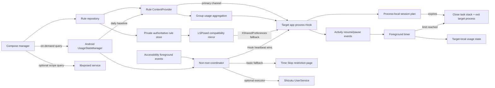
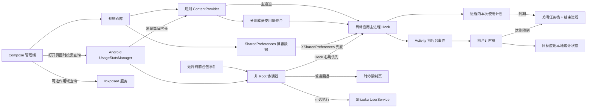

# Time Stop

> Precision app-time control for Android power users who want policy, telemetry, and enforcement in the same loop.


Stock screen-time tools are usually built for reports, daily caps, and focus modes. **Time Stop** is built for people who want sharper controls: per-app quotas, per-launch timers, weekly allow/block windows, shared group budgets, cooldowns after forced exits, Hook verification, and diagnostics that show what is actually happening inside the target process.

[Latest release](https://github.com/Xposed-Modules-Repo/com.liuml.apptimelimiter/releases/latest) · [LSPosed module page](https://modules.lsposed.org/module/com.liuml.apptimelimiter/) · [Obtainium](#obtainium) · [中文说明](#中文说明)

Current version: `0.10.15`

## Why Not Just Use Stock Screen Time?

Different Android vendors ship different screen-time features, but the usual model is still broad and UI-driven. Time Stop prefers LSPosed when a current Hook is active and otherwise provides non-root control through accessibility foreground events plus Android usage access.

| Dimension | Stock screen time | Time Stop |
| --- | --- | --- |
| Core model | Usage reports, daily limits, focus modes | Composable enforcement rules for selected apps |
| Time granularity | Mostly daily totals | Daily quota + per-launch timer + post-exit cooldown |
| Schedule logic | Commonly fixed focus windows | Allow-only or block-during weekly windows, multi-day and overnight aware |
| Shared budgets | Rare or vendor-specific | App groups with one shared daily allowance |
| Enforcement path | System blocker or reminder | Countdown plus force exit by default, or an optional standalone Time Stop break page |
| Observability | Usually hidden | Hook heartbeat, rule source, limit hits, and diagnostic logs |
| Runtime | System feature | LSPosed when available, or non-root accessibility + usage access |

Time Stop is not a soft "please stop scrolling" timer. It is a small policy engine for app usage: rules, foreground accounting, warning UI, exit execution, statistics, update checks, and field diagnostics all live in one workflow.

## Feature Highlights

| Capability | What it does |
| --- | --- |
| Independent app rules | Each app keeps its own enabled state, daily quota, per-launch quota, schedule windows, warning style, and cooldown behavior. |
| App groups and shared allowance | Put multiple apps into one group with shared daily, per-launch, schedule, and cooldown rules. Group members run only the group policy; saved personal rules are suspended and resume after removal. |
| Non-root basic protection | Uses a content-blind accessibility service for foreground package changes plus Android usage access for daily calibration. An opt-in enhanced compatibility mode adds package-only content-change events for ROMs that miss normal window events; it still retrieves no nodes, text, input, or notifications and uses no foreground service or continuous polling. |
| Optional Shizuku enhancement | Shizuku only executes a validated force-stop for configured third-party targets. Missing permission, a stopped service, binder failure, or a protected system package falls back to the normal restriction page. |
| Daily cumulative mode | Uses the stronger source for each app: Android system usage when available, or Hook-local foreground accounting, then resets at local midnight. |
| Per-launch mode | Starts a fresh timer when the target app's main process begins a foreground session. |
| Session planning | Optionally asks for a 5, 10, 15, 30, or custom 1–1440 minute plan when the target process first opens. Quick choices and a direct numeric minute field share one compact page, while the fixed footer keeps exit and skip actions visible. Values beyond the earliest remaining timed quota are rejected. |
| Weekly schedules | Supports allow-only and block-during windows across multiple weekdays, including overnight ranges. Schedule blocks cannot be bypassed with the delay action. |
| Foreground-only accounting | Counts only the `onResume` to `onPause` phase. Background residency does not burn the quota. |
| Warning UI | Shows a five-second top banner or opt-in full-screen warning matching the selected global color, with an optional one-shot long vibration, an exit action, and layout handling for portrait, landscape, display cutouts, and immersive apps. |
| Enforcement mode | Defaults to closing the task and safe third-party target process. The themed standalone break page uses a 30-second, single-use internal token, offers an exit-to-Home action, and attempts to pause common media. Media-object hooks are installed only when a target process starts in break-page mode, so force-stop and reopen managed apps after switching modes. |
| Language | Supports system-default, Simplified Chinese, and English UI; Hook warnings use the same preference. |
| Appearance | Offers health green, calm blue, and focus purple across management and target-side surfaces, each with follow-system, light, and dark modes. |
| Delay action | Lets the user add 1-60 minutes for normal time limits while keeping schedule blocks strict. |
| Post-exit cooldown | Blocks reopening for 1-1,440 minutes after a daily or per-launch quota event. A group uses one fixed shared cooldown window for all members; repeated openings never refresh its start or inflate limit-hit counts. Schedule denials do not start cooldown. |
| Group sync loop | Grouped foreground apps synchronize usage every 15 seconds without keeping the manager app alive. |
| Hook and scope status | Reads framework and scope state through the optional libxposed service when supported, can request missing scope with framework confirmation, and keeps the current-version Hook heartbeat as the compatibility fallback. |
| Diagnostics | Logs Hook setup, rule reads, timer starts, sync events, stats writes, and limit exits so configuration problems are traceable. |
| System-app guardrails | Third-party apps can have their target process terminated; system apps only have their UI closed. |
| Updates and feedback | Checks GitHub Releases automatically when the manager opens (rate-limited and configurable), actively prompts for a new stable release, uses Android's download manager for APK updates, and offers email diagnostics or QQ group `1009712674` for feedback and beta participation. |

Changing a rule resets the Hook-local accumulator for that app, but Android's system usage for the current day remains part of the daily baseline when usage access is granted. That makes rule tweaking visible, not a loophole.

## Architecture


```mermaid
flowchart LR
    UI["Compose manager"] --> Repo["Rule repository"]
    Repo --> Provider["Rule ContentProvider"]
    Repo --> Primary["Private authoritative rule store"]
    Primary --> Prefs["LSPosed compatibility mirror"]
    Provider -->|"primary channel"| Hook["Target app process Hook"]
    Provider --> Groups["Group usage aggregation"]
    Groups --> Hook
    Prefs -->|"XSharedPreferences fallback"| Hook
    Hook --> Lifecycle["Activity resume/pause events"]
    Lifecycle --> Timer["Foreground timer"]
    Hook --> SessionPlan["Process-local session plan"]
    SessionPlan -->|"expires"| Exit
    Timer -->|"limit reached"| Exit["Close task stack + exit target process"]
    Timer --> State["Target-local usage state"]
    UI -->|"on-demand query"| UsageStats["Android UsageStatsManager"]
    UsageStats -->|"daily baseline"| Provider
    UI -->|"optional scope query"| XposedService["libxposed service"]
    Accessibility["Accessibility foreground events"] --> Coordinator["Non-root coordinator"]
    UsageStats --> Coordinator
    Coordinator -->|"Hook heartbeat wins"| Hook
    Coordinator -->|"basic fallback"| BreakPage["Time Stop restriction page"]
    Coordinator -->|"optional executor"| Shizuku["Shizuku UserService"]
```

Key source files:

- `app/src/main/java/com/liuml/apptimelimiter/MainActivity.kt`: Compose UI, app management, group management, statistics, and settings.
- `app/src/main/java/com/liuml/apptimelimiter/data/RuleRepository.kt`: rule persistence, global settings, groups, and compatibility exports.
- `app/src/main/java/com/liuml/apptimelimiter/ipc/RuleProvider.kt`: controlled IPC for rule reads, diagnostics, statistics, and Hook verification.
- `app/src/main/java/com/liuml/apptimelimiter/statistics/`: Android usage-event calculation and module statistics.
- `app/src/main/java/com/liuml/apptimelimiter/xposed/AppTimeLimitHook.kt`: lifecycle hooks, timers, group sync, cooldowns, warnings, and exit execution.
- `app/src/main/java/com/liuml/apptimelimiter/nonroot/`: accessibility coordination, 30-second sessions, plan overlay, restriction fallback, and restricted Shizuku execution.
- `app/src/main/java/com/liuml/apptimelimiter/core/`: pure policy helpers covered by unit tests.
- `xposed-stubs/`: compile-time Xposed API signatures; they are not packaged into the APK.

## Build

Requirements: JDK 17 and Android SDK 37 (`targetSdk` remains 35).

```powershell
.\gradlew.bat testDebugUnitTest lintDebug assembleDebug
```

If Windows path encoding causes Kotlin or JUnit classpath errors, build from a temporary ASCII drive:

```powershell
subst T: "<repo absolute path>"
T:
.\gradlew.bat clean testDebugUnitTest lintDebug assembleDebug
subst T: /d
```

The debug APK is generated at `app/build/outputs/apk/debug/app-debug.apk`.

## Installation

1. Install the APK, open **Time Stop**, select target apps, and save rules or groups.
2. For non-root protection, enable it in Settings and grant the disclosed accessibility service plus usage access. Android manages the service lifecycle; Time Stop adds no foreground service.
3. Optionally enable Shizuku enhancement and grant its permission. It improves execution only and is not used for timing.
4. On rooted devices, enable the module in LSPosed and scope controlled apps. Force-stop and reopen targets after scope changes; a current Hook heartbeat automatically takes priority over non-root timing.

Time Stop checks required non-root permissions when the manager opens and when it returns from system settings. Missing accessibility or usage access is reported as inactive protection; missing Shizuku permission is reported separately while the basic restriction-page fallback remains available.

When upgrading from a build that stored its only rule copy in LSPosed's redirected preferences, open Time Stop once while the module is still enabled. This performs a one-time migration to the stable private manager store. After that migration, disabling LSPosed no longer switches the manager UI to a different rule database.

On frameworks that expose the modern service, Time Stop can read scope before the target app is opened and request missing packages through the framework confirmation UI. Older frameworks fall back to the persisted `HOOK_READY` heartbeat, so "Hook verified" means the target app has successfully loaded this module version before.

## Distribution

### GitHub Releases

The official APK is published from the LSPosed mirror repository:

<https://github.com/Xposed-Modules-Repo/com.liuml.apptimelimiter/releases/latest>

### Obtainium

Time Stop works with Obtainium by tracking GitHub Releases:

- App source URL: `https://github.com/Xposed-Modules-Repo/com.liuml.apptimelimiter`
- Source type: GitHub Releases
- APK asset pattern: `app-time-limiter-v*.apk`

Obtainium is a third-party updater. It does not change Time Stop's protection engine; it only checks the release page and installs the APK selected by the user.

### F-Droid

Time Stop is licensed as GPL-3.0-only so it can be submitted to F-Droid-compatible repositories. Packaging metadata is kept in `packaging/fdroid/`. Until the official F-Droid review is accepted, use GitHub Releases, LSPosed, Obtainium, or a self-hosted F-Droid repository.

## Diagnostics

Open **Diagnostic Logs** from the home screen and check:

- `RULE_SAVED`: the manager saved the rule.
- `HOOK_READY`: the lifecycle Hook is running in the target process.
- `RULE_READ ... source=provider`: the primary rule channel is working.
- `RULE_READ ... source=xsharedpreferences`: the compatibility fallback is being used.
- `TIMER_START`: foreground timing has started.
- `SESSION_PLAN_PROMPT/STARTED/REPLANNED/SKIPPED/EXPIRED` and `SESSION_PLAN_PROMPT_INTERRUPTED`: lifecycle of the process-local session plan.
- `EXTERNAL_BREAK_PAGE_SHOWN/UPDATED/REMOVED/FAILED`: standalone break-page display, rule changes, recovery, and safe-exit fallback.
- `MEDIA_PAUSE_ATTEMPT/MEDIA_PAUSE_FAILED`: best-effort pause result for common platform, ExoPlayer/Media3, and web media.
- `REST_CYCLE_RESUMED`: a per-launch break ended and a fresh foreground cycle started.
- `GROUP_COOLDOWN_STARTED/REUSED/EXPIRED` and `QUOTA_INCIDENT_DUPLICATE`: shared group cooldown ownership, reuse, expiry, and duplicate suppression.
- `SESSION_PLAN_WAITING_USAGE`, `SESSION_PLAN_REJECTED_OVER_QUOTA`, and `SESSION_PLAN_UNAVAILABLE`: authoritative usage wait, over-quota rejection, or plan unavailability.
- `SESSION_PLAN_SUPPRESSED_BLOCKED`: a schedule, cooldown, or exhausted quota correctly prevented the plan dialog.
- `COOLDOWN_STARTED/COOLDOWN_PERSIST_FAILED`: cooldown persistence after a quota limit.
- `LIMIT_REACHED`: a configured boundary was reached and exit execution started.
- `PROTECTION_MODE_CHANGED`, `HOOK_MODE_ACKNOWLEDGED`, and `PROTECTION_STATUS_DEGRADED`: selected-mode changes, Hook mode-generation acknowledgement, and protection-health degradation.
- `NON_ROOT_BREAK_PAGE_START_REQUESTED`, `NON_ROOT_BREAK_PAGE_START_ACCEPTED`, `NON_ROOT_BREAK_PAGE_CONFIRMED`, and `NON_ROOT_BREAK_PAGE_CONFIRM_TIMEOUT`: distinguish a launch request, Android accepting it, the page actually gaining foreground focus, and silent vendor-ROM blocking.
- `NON_ROOT_OVERLAY_ADD_REQUESTED`, `NON_ROOT_OVERLAY_ADD_ACCEPTED`, `NON_ROOT_OVERLAY_ATTACH_STATE`, and `NON_ROOT_OVERLAY_ADD_FAILED`: capture session-plan overlay window parameters, attachment state, and the full exception type.
- `NON_ROOT_FOREGROUND_SIGNAL`, `NON_ROOT_FOREGROUND_RECONCILED`, and `NON_ROOT_FOREGROUND_MISMATCH`: record the accepted accessibility source and bounded UsageStats reconciliation before protection UI is shown.
- `NON_ROOT_OVERLAY_DETACHED`, `NON_ROOT_OVERLAY_REATTACHED`, and `NON_ROOT_UI_STATE_CHANGED`: record bounded session-plan overlay recovery and the single-owner non-root UI state.
- `SHIZUKU_FORCE_STOP` and `NON_ROOT_HOME_FALLBACK_RESULT`: report enhanced force-stop execution and the final foreground state after the Home fallback.

If `HOOK_READY` never appears in the in-app log, search LSPosed logs for `AppTimeLimiter: HOOK_INSTALLED` or `HOOK_FAILED`.

`HOOK_INSTALLED` and `HOOK_READY` include the target process bitness and ABI. If neither appears for only a few apps, first check whether those apps are excluded by the Magisk denylist/Zygisk configuration. The Hook uses both the normal Instrumentation lifecycle path and an Activity lifecycle fallback for protected or legacy apps.

The lifecycle Hook remains on the [legacy Xposed Framework API](https://api.xposed.info/reference/de/robv/android/xposed/IXposedHookLoadPackage.html). The manager optionally uses libxposed service API 102 for framework, scope, and running-target status without adding a second modern Hook entry; unsupported frameworks automatically retain heartbeat verification.

## Known Limitations

- Non-root protection is self-management, not tamper-resistant parental control. Revoking accessibility or usage access, force-stopping Time Stop, or uninstalling it stops this path.
- In non-root mode, a per-launch session survives up to 30 seconds away from the target app. Returning within the grace period resumes the same timer and plan; returning later starts a new session.
- Basic non-root enforcement opens Time Stop's standalone restriction page directly so the target Activity pauses and may resume when the restriction clears. It returns Home only if the page cannot open. The target process remains alive and background media may continue. Shizuku force-stop discards the current page and commonly needs to be restarted after a device reboot.
- While a persistent non-root restriction remains active, reopening the target from Home immediately revalidates the current rule and restores the restriction page without waiting for the Hook handshake. This marker only accelerates revalidation and cannot override a changed or cleared rule.
- Non-root mode hides scope, Hook verification, reopen prompts, and historical counter prompts. Accessibility is reported separately as disabled, enabled-but-disconnected, or connected; global permission failures are not repeated as per-app repair errors. LSPosed reads modern service scope directly and treats an in-scope idle app as ready without requiring a heartbeat.
- Launcher and launcher-folder windows are hard foreground boundaries. They pause the managed session while keeping the 30-second grace period, cancel stale restriction callbacks, and never trigger navigation, overlays, Toasts, or another Home action.
- The standalone restriction Activity is the non-root enforcement surface because it naturally pauses the target Activity. Accessibility overlays are reserved for the session-plan picker and short warnings: an overlay can block touches but cannot reliably pause media, games, or the target lifecycle.
- The accessibility service requests no window content and does not read nodes, text, accounts, input, or notifications. Foreground package transitions and local timing or diagnostic data are not uploaded.

- Session planning is process-local: it is offered once per target process, survives Activity changes in that process, and is cleared when the process ends.
- A session plan counts only resumed foreground Activity time. Background and screen-off time is paused by design; this feature does not provide background media playback or a wall-clock sleep timer.
- Session-plan expiry does not add a limit hit or start cooldown. System apps only have their UI closed.
- A session plan must fit within the earliest remaining app or group timed quota. Longer choices are rejected with the available balance, and exhausted quotas, cooldowns, or blocked schedules can never be bypassed.
- The standalone break page pauses the target Activity and attempts to pause common MediaPlayer, ExoPlayer/Media3, and web media. Vendor ROMs may ask before opening Time Stop. Custom players, background services, rendering, or game logic may continue; use force-exit mode when execution must stop completely.
- Rules, statistics, diagnostics, and runtime state are excluded from Android backup and device transfer.
- Per-launch and group per-launch limits start a fresh cycle after configured cooldown. Daily and group-daily quotas remain hard limits until the daily reset; blocked schedules remain active until the allowed period.
- While the standalone page is visible, the target Activity is paused, so Hook-local foreground accumulation also pauses. Playback is never force-resumed by the module.

- Lifecycle tracking uses `Instrumentation.callActivityOnResume/Pause` with a deduplicated `Activity.onResume/onPause` fallback across target processes; diagnostics show the process and bitness that host the UI.
- Already running target apps keep the old Hook after install or upgrade. Force-stop and reopen them to load the new module code.
- Activities that remain resumed in picture-in-picture or split-screen mode continue to count toward the limit.
- Multiple resumed apps in the same group synchronize increments every 15 seconds, so concurrent multi-window use can exceed the shared allowance by up to one sync interval.
- Every group member must still be in LSPosed scope. Compatible frameworks can approve missing scope from Time Stop; older frameworks require manual selection. An unhooked member can count toward shared usage through Android usage stats, but cannot execute its own forced exit.
- The Hook-local daily fallback is stored in the target app's data area. If that data is cleared while usage access remains granted, Android's system usage can still restore the daily baseline.
- A short segment before an unexpected crash may not be persisted if `onPause` is never delivered.
- Only launchable apps are listed. Packages without launcher entries need future manual package-name configuration.
- The app list only shows apps in the Android user that hosts the manager. Work-profile or cloned-user instances are not separately controlled yet because rules and statistics are currently keyed by package name.
- Hook behavior cannot be fully verified across ROMs without a real Root/LSPosed device.

This tool should be used only by the device owner or on explicitly authorized managed devices. Do not install it covertly or use it for unauthorized monitoring.

## 中文说明

# 时停

> 把时间留给真正重要的事。

系统自带的屏幕时间管理通常更侧重**查看使用统计、设置每日限额或开启专注模式**。**时停**则专注于更精细、可组合的单应用规则：不仅能限制一天总共使用多久，还能限制每次连续打开多久，还能规定每周哪些时段允许或禁止使用，并支持应用分组共享额度与退出后冷却。用户可全局选择 LSPosed、普通保护或普通保护 + Shizuku，所有管控应用统一使用所选链路。

[下载最新版本](https://github.com/Xposed-Modules-Repo/com.liuml.apptimelimiter/releases/latest) · [LSPosed 模块页面](https://modules.lsposed.org/module/com.liuml.apptimelimiter/)

当前版本：`0.10.15`

## 它和系统屏幕时间有什么不同？

> 不同厂商和 ROM 的系统功能会有所差异，下表以常见的 Android 屏幕时间管理能力作为对比。

| 对比维度 | 系统自带屏幕时间 | 时停 |
| --- | --- | --- |
| 核心定位 | 查看使用情况、每日限额、专注模式 | 为指定应用建立可组合的强制使用边界 |
| 时间粒度 | 通常以每天的总时长为主 | 每日累计 + 单次打开 + 退出后冷却可组合启用 |
| 时段规则 | 常见为专注模式或固定停用时段 | 支持“仅指定时段允许”与“指定时段禁止”、多星期组合和跨午夜规则 |
| 共享额度 | 很少提供，或强依赖厂商实现 | 支持多个应用共享同一个每日额度 |
| 到达限制后 | 通常显示系统拦截页或提醒 | 先倒计时提醒，再关闭任务栈并结束目标应用界面所在进程 |
| 生效验证 | 通常不展示具体执行链路 | 提供真实 Hook 心跳、规则来源和限制触发诊断日志 |
| 运行方式 | 系统原生，无需 Root | 全局互斥选择 LSPosed、普通保护或普通保护 + Shizuku，不自动混合接管 |

系统自带功能更适合快速了解整体使用习惯；时停更适合希望对某些应用设置**更细粒度、更明确、更难随手忽略**的使用规则。

时停也不只是一个“到点弹窗”的计时器。它覆盖从**规则配置、前台计时、到期提醒和限制执行**，到**使用统计、Hook 验证、故障诊断、在线更新和问题反馈**的完整使用流程。

## 功能丰富，覆盖完整使用流程

| 能力 | 说明 |
| --- | --- |
| 独立应用规则 | 每个应用分别保存启用状态、时间额度和时段计划，互不影响。 |
| 应用分组与统一规则 | 可为一组应用统一开启共享每日额度、单次打开、可用时段和退出后冷却。组内成员只执行分组规则；已有个人配置会保留但暂停，移出分组后自动恢复。 |
| 全局保护模式 | 设置中三选一：LSPosed、普通保护、普通保护 + Shizuku。模式切换后目标应用需强停并重开，面板通过模式代次确认 Hook 已加载新配置。 |
| 非 Root 普通保护 | 通过无障碍服务感知前台包名，通过系统使用情况访问校准每日累计；可选“增强兼容检测”为漏发普通窗口事件的系统增加包名级内容变化事件，但仍不读取页面节点、文字、输入内容或通知，不启动前台常驻服务，也不持续轮询。 |
| Shizuku 强停模式 | Shizuku 只负责在到限后强停已配置的第三方应用，不参与计时；未安装、未授权、服务未运行、Binder 断开或执行失败时自动回退普通限制页，不切换到 LSPosed。 |
| 设置内保护状态 | 设置顶部同时展示所选模式、实际执行链路、明确异常和修复入口；LSPosed 未取得权威证据时显示“等待验证”而不是误报未生效，Shizuku 不可用时明确回退普通保护独立限制页。 |
| 应用列表过滤 | 应用管理默认只显示第三方应用；需要管理系统应用时可手动开启“显示系统应用”。 |
| 每日累计限制 | 为每个应用设置 1-1440 分钟的每日额度；有“使用情况访问权限”时，以 Android 系统时长和 Hook 本地计时的较大值判定，跨零点自动重置。 |
| 单次打开限制 | 每次目标应用主进程启动后重新计时，适合控制一次连续使用的时长。 |
| 本次使用计划 | 可为单个应用开启“打开时制定计划”；同一页面提供 5、10、15、30 分钟快捷选择和 1–1440 分钟数字输入。LSPosed 与非 Root 共用同一界面组件，固定底栏确保退出和跳过按钮始终可见；超过最早剩余额度的选项与输入会被拒绝，最终提交仍再次校验。 |
| 每周时段规则 | 支持“仅指定时段允许”和“指定时段禁止”，可组合多个星期并覆盖跨午夜时段。 |
| 精确前台计时 | 仅统计 Activity 处于前台的时间，应用切到后台后暂停计时。 |
| 到期提醒与延时 | LSPosed Hook 目标到期前 5 秒可显示与全局颜色主题一致的顶部或全屏倒计时、触发一次长震动，并提供退出应用或临时延长 1-60 分钟；纯非 Root 模式不显示这些 Hook 专属设置，本次计划在结束前 5 秒提供退出或重新计划入口。 |
| 限制执行方式 | 设置页按引擎分别显示有效选项：LSPosed 可选“强制退出”或“独立休息页”；非 Root 普通保护可选“独立限制页”或需要 Shizuku 的“强制退出”。独立页跟随全局颜色和明暗主题并提供退出到桌面的按钮；Shizuku 不可用或执行失败时自动回退限制页。 |
| 语言 | 支持跟随系统、简体中文和 English，管理界面与目标应用内 Hook 提醒使用同一设置。 |
| 外观 | 提供健康绿、宁静蓝、专注紫三套全局颜色，并分别支持跟随系统、浅色和深色；计划弹窗、全屏提醒和独立限制页还可随机显示内置或自定义时间短句。 |
| 退出后冷却 | 每日或单次额度触发限制后，可在 1-1440 分钟内禁止再次打开。分组使用一份固定的共享冷却状态：任一成员触发后，全组看到相同剩余时间；反复打开不会刷新起点或重复统计。禁止时段拒绝不会启动冷却。 |
| 使用统计 | 首页和统计页按需读取 Android `UsageStatsManager`，根据前台事件计算各应用时长和启动次数；熄屏会清除厂商系统遗漏的旧前台状态，“今日总使用”按所有应用前台区间的并集去重，因此不会因分屏或事件重叠而超过当天已过去的时间。 |
| Hook 与作用域状态 | 支持的框架可通过 libxposed 服务直接读取作用域并向框架申请补充作用域；旧框架继续使用当前版本 Hook 回传作为兼容验证。 |
| 多级规则回退 | 优先通过受控 Provider 读取规则，并提供 `XSharedPreferences` 与本地缓存回退，增强不同 ROM 下的可用性。 |
| 诊断日志 | 记录 Hook 安装、规则来源、计时开始与暂停、统计写入和限制触发，方便快速定位配置问题。 |
| 系统安全保护 | 第三方应用到期后结束自身进程；系统应用只关闭界面，不结束系统进程，并记录开机诊断锚点。 |
| 个性化设置 | 可选择顶部或全屏退出提醒、长震动，并控制主题、语言、诊断记录和默认延时时长；修改规则后会重置 Hook 本地累计，系统当日时长仍保留。 |
| 隐藏桌面入口 | 只在可确认 LSPosed 模块设置入口时提供隐藏选项；`MainActivity` 保留标准模块入口并提供 ADB 恢复。纯非 Root 模式不会显示无效的隐藏开关，旧配置已隐藏时只提供恢复入口。 |
| 功能导览与联系 | 每次打开管理应用时可左右滑动查看主要功能；每个新版本首次运行会依次显示一次内测和自愿捐赠公告。设置与“关于”页支持邮件或 QQ 群 `1009712674` 反馈，并提供加入内测和软件声明入口。 |
| 更新与反馈 | 默认在打开管理应用时限频检查 GitHub Releases，发现稳定新版后主动提醒；可关闭自动检查，并可调用系统下载管理器更新、通过邮件附带诊断日志反馈问题。 |

Hook 计时仅覆盖 `Activity.onResume` 到 `Activity.onPause` 的前台阶段，切到后台会暂停。修改规则时会重置该应用的 Hook 本地累计；如果已授权系统使用统计，Android 记录的当日时长仍会参与每日限制，不能通过修改规则清零。

## 架构


```mermaid
flowchart LR
    UI["Compose 管理端"] --> Repo["规则仓库"]
    Repo --> Provider["规则 ContentProvider"]
    Repo --> Prefs["SharedPreferences 兼容数据"]
    Provider -->|"主通道"| Hook["目标应用主进程 Hook"]
    Provider --> Group["分组成员使用量聚合"]
    Group --> Hook
    Prefs -->|"XSharedPreferences 兜底"| Hook
    Hook --> Lifecycle["Activity 前后台事件"]
    Lifecycle --> Timer["前台计时器"]
    Hook --> SessionPlan["进程内本次使用计划"]
    SessionPlan -->|"到期"| Exit
    Timer -->|"达到限制"| Exit["关闭任务栈 + 结束进程"]
    Timer --> State["目标应用本地累计状态"]
    UI -->|"打开页面时按需查询"| UsageStats["Android UsageStatsManager"]
    UsageStats -->|"系统每日时长"| Provider
    UI -->|"可选作用域查询"| XposedService["libxposed 服务"]
    Accessibility["无障碍前台包事件"] --> Coordinator["非 Root 协调器"]
    UsageStats --> Coordinator
    Coordinator -->|"Hook 心跳优先"| Hook
    Coordinator -->|"普通回退"| BreakPage["时停限制页"]
    Coordinator -->|"可选执行"| Shizuku["Shizuku UserService"]
```

主要代码：

- `app/src/main/java/com/liuml/apptimelimiter/MainActivity.kt`：Compose 首页、应用管理、分组管理、统计和设置。
- `app/src/main/java/com/liuml/apptimelimiter/data/RuleRepository.kt`：规则、全局设置、应用分组与兼容数据持久化。
- `app/src/main/java/com/liuml/apptimelimiter/ipc/RuleProvider.kt`：规则读取、统计、诊断和 Hook 验证 IPC。
- `app/src/main/java/com/liuml/apptimelimiter/statistics/`：系统使用事件计算和模块统计。
- `app/src/main/java/com/liuml/apptimelimiter/xposed/AppTimeLimitHook.kt`：生命周期 Hook、计时、分组同步、冷却、提醒和退出逻辑。
- `app/src/main/java/com/liuml/apptimelimiter/nonroot/`：全局模式下的非 Root 会话、无障碍计划浮层、限制页回退与受限 Shizuku 执行。
- `app/src/main/java/com/liuml/apptimelimiter/core/`：可单元测试的纯策略代码。
- `xposed-stubs/`：只用于编译的传统 Xposed API 签名，不会打包进 APK。

## 构建

环境要求：JDK 17、Android SDK 37（`targetSdk` 仍为 35）。

```powershell
.\gradlew.bat testDebugUnitTest lintDebug assembleDebug
```

当前工作区路径含中文；如果 Windows 上单元测试报 `ClassNotFoundException`，可临时映射英文盘符：

```powershell
subst T: "<你的项目目录>"
T:
.\gradlew.bat clean testDebugUnitTest lintDebug assembleDebug
subst T: /d
```

调试 APK 输出到 `app/build/outputs/apk/debug/app-debug.apk`。

## 安装和使用

1. 安装 APK，打开“时停”，选择目标应用并保存规则或分组。
2. 在设置中全局选择“LSPosed”“普通保护”或“普通保护 + Shizuku”；所有目标应用统一使用该模式，不会自动切换到另一条链路。
3. 选择普通保护后，阅读用途披露，启用时停无障碍服务并授予使用情况访问。服务由 Android 管理，不增加前台常驻通知。
4. 选择 Shizuku 模式时再完成 Shizuku 授权；它只改善到限执行，不参与计时。保护状态与修复入口集中在设置顶部；切换模式后下一次打开目标应用由新模式接管，只有明确加载旧 Hook 或加载失败时才需要单独重开。

时停会在管理界面首次打开及从系统设置返回时检查普通保护权限。无障碍状态区分“未开启”“已开启但服务未连接”和“已连接运行”，并综合系统已启用组件、系统服务列表与服务真实生命周期；无需为了刷新显示而反复开关。使用情况访问缺失时普通保护不会计时；Shizuku 未授权或未运行会单独提示，但基础独立限制页仍可继续工作。

如果从“规则仅保存在 LSPosed 重定向偏好”的旧版本升级，请先保持模块启用并打开一次时停，完成向稳定私有主库的一次性迁移。迁移完成后，再关闭 LSPosed 也不会让管理界面切换到另一份空规则库。

支持现代服务的框架可在目标应用尚未打开时直接显示作用域状态，缺少作用域时可通过框架确认界面申请加入。旧版 LSPosed 会自动回退到 `HOOK_READY` 心跳验证；此时“Hook 已验证”表示目标应用曾成功加载当前版本。

## 分发渠道

### GitHub Releases

官方 APK 发布在 LSPosed 镜像仓库：

<https://github.com/Xposed-Modules-Repo/com.liuml.apptimelimiter/releases/latest>

### Obtainium

时停可通过 Obtainium 跟踪 GitHub Releases 更新：

- 应用来源 URL：`https://github.com/Xposed-Modules-Repo/com.liuml.apptimelimiter`
- 来源类型：GitHub Releases
- APK 文件匹配：`app-time-limiter-v*.apk`

Obtainium 是第三方更新工具，只负责检查 Release 页面并由用户选择安装 APK，不改变时停自身的保护链路。

### F-Droid

时停已改为 GPL-3.0-only 授权，可提交到 F-Droid 兼容仓库。打包元数据放在 `packaging/fdroid/`。在官方 F-Droid 审核通过前，请继续使用 GitHub Releases、LSPosed、Obtainium 或自建 F-Droid 仓库。

## 诊断日志判断方法

在首页点击“诊断日志”，重点查看以下事件：

- `RULE_SAVED`：管理端保存成功，但 Hook 没有进入目标应用；检查 LSPosed 模块开关、目标应用作用域，并强制停止目标应用后重开。
- `HOOK_READY`：生命周期 Hook 已经运行。
- `RULE_READ ... source=provider`：新版规则通道工作正常。
- `RULE_READ ... source=xsharedpreferences`：Provider 不可用，正在走旧兼容通道；这通常是系统包可见性或 ROM 限制。
- `TIMER_START`：前台计时已开始，日志会显示剩余秒数。
- `SESSION_PLAN_PROMPT/STARTED/REPLANNED/SKIPPED/EXPIRED` 与 `SESSION_PLAN_PROMPT_INTERRUPTED`：本次使用计划从询问、Activity 交接、开始、重新制定到跳过或到期的完整链路。
- `EXTERNAL_BREAK_PAGE_SHOWN/UPDATED/REMOVED/FAILED`：独立休息页显示、规则变化、解除或启动失败后回退退出。
- `MEDIA_PAUSE_ATTEMPT/MEDIA_PAUSE_FAILED`：常见系统播放器、ExoPlayer/Media3 与网页媒体的尽力暂停结果。
- `REST_CYCLE_RESUMED`：单次额度冷静结束，已开始新的前台使用轮次。
- `GROUP_COOLDOWN_STARTED/REUSED/EXPIRED` 与 `QUOTA_INCIDENT_DUPLICATE`：分组共享冷却的认领、复用、到期及重复事件去重。
- `SESSION_PLAN_WAITING_USAGE`、`SESSION_PLAN_REJECTED_OVER_QUOTA` 与 `SESSION_PLAN_UNAVAILABLE`：等待权威用量、超过剩余额度被拒绝，或因规则变化、额度耗尽而不可制定计划的链路。
- `SESSION_PLAN_SUPPRESSED_BLOCKED`：禁止时段、冷却或额度耗尽正确阻止了计划弹窗。
- `COOLDOWN_STARTED/COOLDOWN_PERSIST_FAILED`：额度限制后的冷却起点保存结果。
- `LIMIT_REACHED`：限制已达到，代码已发出关闭任务栈和结束进程操作。
- `EXIT_REENTRY_DETECTED` 与 `EXIT_RECOVERY_RECHECK`：系统应用只关闭界面后，被桌面、负一屏或其他外部入口再次拉起；模块会关闭新页面，并在退出恢复窗口结束时复检仍处于前台的 Activity。
- `PROTECTION_MODE_TRANSITION_STARTED/COMPLETED`、`HOOK_UI_CANCELLED_BY_MODE` 与 `PROTECTION_EFFECTIVE_STATE_CHANGED`：模式切换、旧 Hook UI 取消和实际执行状态变化。
- `PERMISSION_REPAIR_PROMPT_*`：权限提醒展示、72 小时冷却、同类问题压制及修复动作。
- `BREAK_PAGE_COMPATIBILITY_REQUIRED` 与 `OEM_COMPATIBILITY_SETTINGS_*`：独立限制页被厂商系统拦截及兼容设置跳转结果。
- `NON_ROOT_BREAK_PAGE_START_REQUESTED`、`NON_ROOT_BREAK_PAGE_START_ACCEPTED`、`NON_ROOT_BREAK_PAGE_CONFIRMED` 与 `NON_ROOT_BREAK_PAGE_CONFIRM_TIMEOUT`：区分限制页请求、系统接受启动、真正获得前台焦点和厂商系统静默拦截。
- `NON_ROOT_RESTRICTION_REENTRY` 与 `NON_ROOT_RESTRICTION_STATE_PERSIST_FAILED`：记录返回目标应用时的限制快速复核，以及复入标记写入失败。
- `NON_ROOT_OVERLAY_ADD_REQUESTED`、`NON_ROOT_OVERLAY_ADD_ACCEPTED`、`NON_ROOT_OVERLAY_ATTACH_STATE` 与 `NON_ROOT_OVERLAY_ADD_FAILED`：记录本次计划浮层的窗口类型、flags、附着状态和完整异常类型。
- `NON_ROOT_FOREGROUND_SIGNAL`、`NON_ROOT_FOREGROUND_RECONCILED` 与 `NON_ROOT_FOREGROUND_MISMATCH`：记录无障碍前台信号来源，以及展示管控界面前的一次性 UsageStats 纠偏结果。
- `NON_ROOT_OVERLAY_DETACHED`、`NON_ROOT_OVERLAY_REATTACHED` 与 `NON_ROOT_UI_STATE_CHANGED`：记录计划浮层异常脱离后的有界恢复和非 Root 界面单实例状态。
- `SHIZUKU_FORCE_STOP` 与 `NON_ROOT_HOME_FALLBACK_RESULT`：记录增强强停结果，以及限制页失败后返回桌面的最终前台状态。

如果应用内日志完全没有 `HOOK_READY`，还可以在 LSPosed 日志中搜索 `AppTimeLimiter: HOOK_INSTALLED` 或 `HOOK_FAILED`。

`HOOK_INSTALLED` 与 `HOOK_READY` 会记录目标进程位数和 ABI。若只有少数应用完全没有这两类日志，应先检查它们是否被 Magisk 排除列表或 Zygisk 配置排除。模块同时保留常规 Instrumentation 生命周期入口和面向旧版、加固应用的 Activity 生命周期兜底。

生命周期 Hook 继续使用[传统 Xposed Framework API](https://api.xposed.info/reference/de/robv/android/xposed/IXposedHookLoadPackage.html)。管理端可选使用 libxposed service API 102 读取框架、作用域与运行目标状态，不增加第二个现代 Hook 入口；不支持服务的框架会自动回退心跳验证。

## 已知限制

- 非 Root 普通保护属于自我时间管理，不是不可绕过的家长控制。关闭无障碍或使用情况访问、强停或卸载时停后，这条保护链路会停止。
- 非 Root 的“单次打开”按前台会话计算：离开目标应用 30 秒内返回会继续同一单次计时与计划，超过 30 秒再返回会建立新会话。
- 普通保护到限后直接显示独立限制页，让目标 Activity 自然暂停；条件解除后关闭限制页并尝试恢复原内容，只有限制页启动失败时才返回桌面。目标进程不会被结束，后台音乐可能继续。限制页使用独立任务栈，不会阻止用户从桌面打开时停管理界面。Shizuku 可强停已配置的第三方应用，但会丢失当前页面，且非 Root Shizuku 通常需要在重启后重新启动。
- 非 Root 的持续限制生效后，从限制页回桌面再打开目标应用会立即复核当前规则并恢复限制页，不再等待 Hook 握手。持久标记只用于加速复核，不能覆盖已经解除或修改的规则。
- 非 Root 模式不显示作用域、Hook 验证、强停重开或旧计数提示；全局权限异常只显示一次。LSPosed 模式直接使用 API 102 作用域结果，应用已在作用域但尚未启动时同样视为就绪，只在明确缺少作用域或当前运行目标异常时显示修复提示。
- 桌面、桌面文件夹和最近任务不会触发限制动作。离开目标应用后前台计时暂停并保留30秒会话宽限；旧限制页确认、计划浮层和返回桌面回调会随前台代次变化立即失效。
- 部分厂商系统会遗漏 Activity 暂停事件。统计器在熄屏时清除旧前台状态，亮屏后等待新的前台事件；这可避免多个应用重复累计同一批亮屏时间，但厂商事件本身缺失时仍可能出现少量误差。
- 非 Root 正式限制界面采用独立 Activity，因为它能让目标 Activity 自然进入暂停；无障碍悬浮层只用于本次计划选择和短提示。悬浮层虽能拦截触摸，但不能可靠暂停播放器、游戏引擎或目标生命周期，因此不作为到限限制页。
- 无障碍服务不读取窗口内容、页面节点、文字、账号、输入内容或通知；前台包变化、本地计时和诊断数据不会上传。
- 退出重入诊断只记录目标 Activity 类名、组件、Intent action、来源 host、进程和 PID，不记录 Intent URI、搜索词或页面内容。
- “增强兼容检测”默认关闭；开启后只使用内容变化事件携带的包名，并对模糊信号进行一次性 UsageStats 校验，`canRetrieveWindowContent` 始终保持关闭。

- 本次使用计划只保存在目标进程内：每个目标进程首次打开时询问一次，应用内页面切换或短暂切后台不会重复询问，进程结束后自动清除。
- 计划只计算 Activity 处于 Resume 的前台时间；切后台和息屏会暂停，不提供后台媒体播放或真实时间睡眠定时能力。
- 计划到期不增加限制触发次数，也不启动冷却；系统应用到期时只关闭界面。
- 本次计划只能在现有自由额度内制定；所选时长超过应用或分组中最早到期的剩余额度时会被拒绝并提示选择更短时长。额度已耗尽、处于冷却或禁止时段时也不能通过计划绕过。
- 独立休息页会让目标 Activity 进入暂停，并尽力暂停常见 MediaPlayer、ExoPlayer/Media3 与网页媒体。部分系统可能先询问是否允许打开时停；自研播放器、后台服务、渲染或游戏引擎仍可能继续，需要彻底停止运行时请使用“强制退出”。
- 单次和分组单次额度配合冷却时，冷静结束后会清零当前轮次并继续使用；每日和分组每日额度仍限制到次日重置，禁止时段仍限制到允许时间。
- 独立休息页显示时目标 Activity 已暂停，因此 Hook 本地前台累计也暂停；模块不会在休息结束后强制恢复播放。
- 规则、统计、诊断和运行状态不参与 Android 系统备份或设备迁移。

- 生命周期计时使用 `Instrumentation.callActivityOnResume/Pause` 主入口和去重后的 `Activity.onResume/onPause` 兜底，并覆盖目标包的各进程；日志会显示实际承载界面的进程名与位数。
- 安装或升级模块后，已经运行的目标应用仍保留旧版 Hook；必须强制停止目标应用再打开。只有当前运行状态明确异常时，应用列表或首页才会提示处理。
- 画中画、分屏状态下，只要 Activity 保持 Resume 就会继续计时。
- 同一分组的多个应用在分屏中同时 Resume 时，目标进程每 15 秒同步一次分组增量；共享额度可能有不超过一个同步周期的并发误差。
- 分组成员仍必须位于 LSPosed 作用域；支持现代服务的框架可在时停中确认申请，旧框架仍需手动勾选。未 Hook 的成员会被系统统计计入共享额度，但自身无法执行强制退出。

- 每日累计的本地兜底状态保存在目标应用数据区；清除目标应用数据后，如已授予“使用情况访问权限”，系统当日时长仍会重新参与限制判定。
- 目标应用或系统崩溃时，最后一个尚未触发 `onPause` 的短时间片可能没有持久化。
- 应用列表只查询带 Launcher 入口的软件；没有桌面入口的包暂不显示，需要在后续版本增加手动包名配置。
- 应用列表只显示管理端所在 Android 用户中的应用，其他用户/工作资料中的双开实例会被隐藏。LSPosed 的作用域以“包名 + 用户 ID”区分实例，而当前规则与统计仅以包名为键，因此暂不提供跨用户双开管控。
- 未连接真实 Root/LSPosed 设备时，只能完成编译、单元测试和 APK 结构校验，不能验证不同 ROM 的 Hook 行为。

本工具应仅用于设备所有者本人或已明确授权的受管设备，不应隐蔽安装或用于未经同意的监控。

## 软件许可与版权

时停是采用 GPL-3.0-only 授权的自由软件。你可以在 GNU General Public License 第 3 版的条款下使用、学习、修改和再分发本项目。完整条款见 [LICENSE](LICENSE)，第三方组件仍分别遵循其原有许可证。
